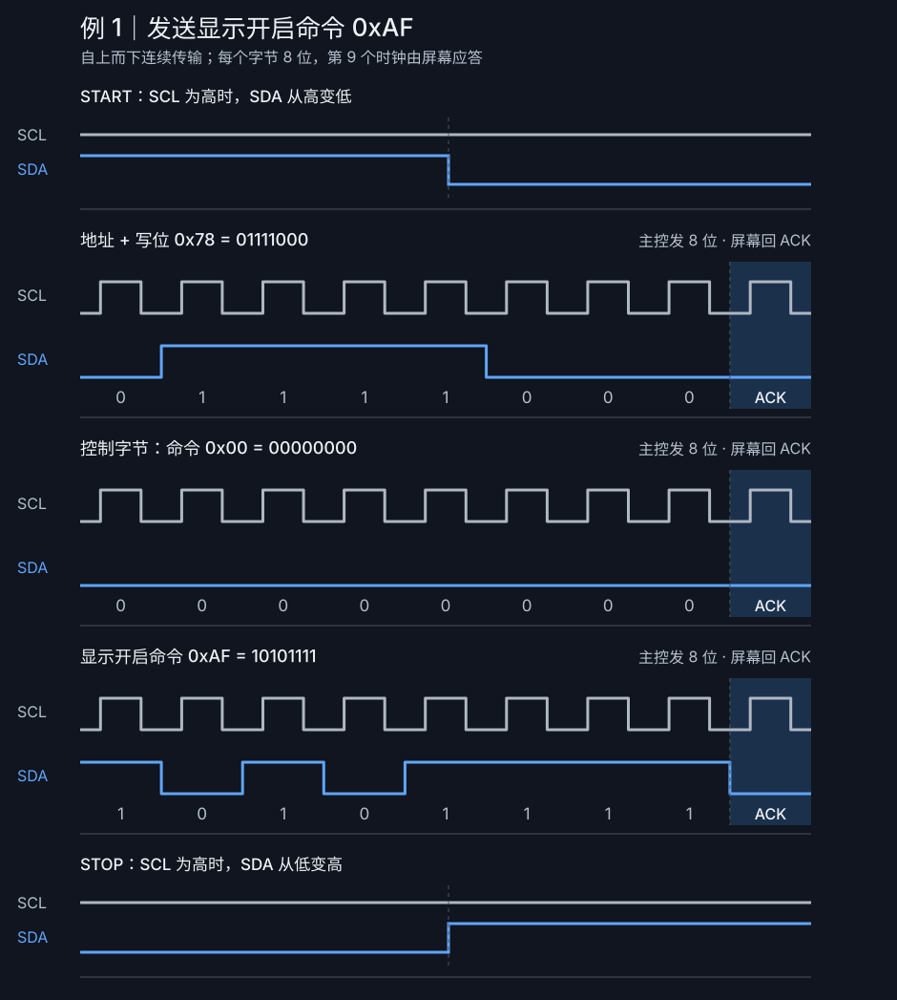
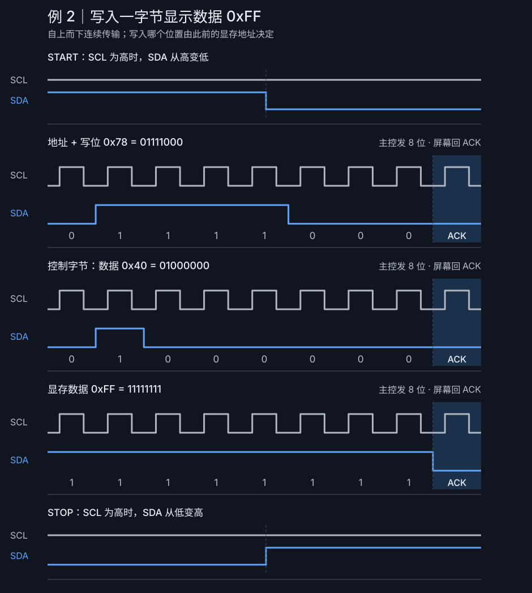
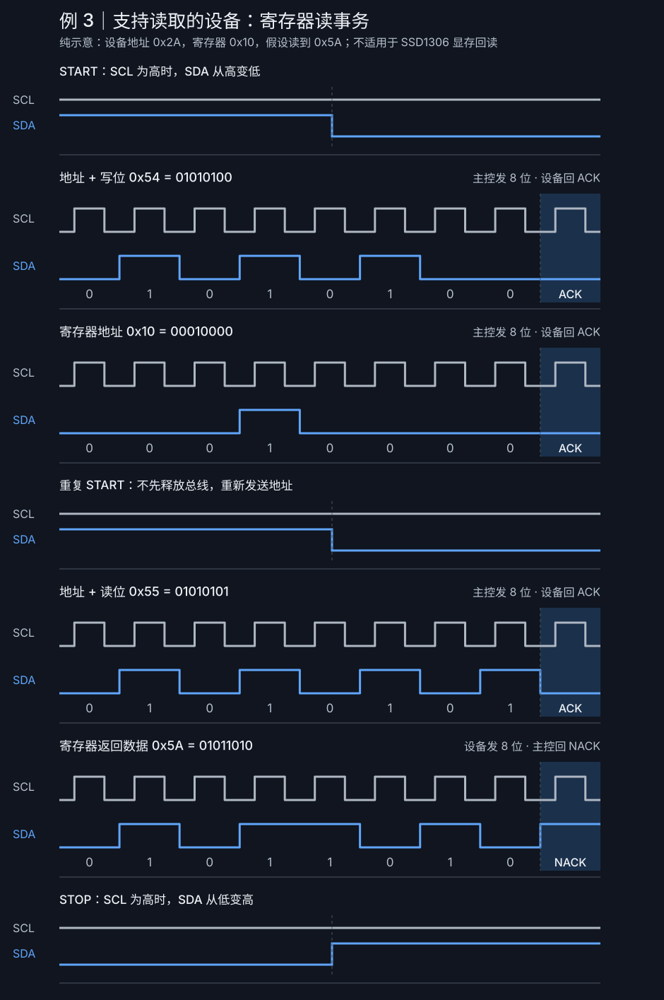

# 嵌入式面试知识点笔记

按知识点整理面试经验。I2C 章节配有显示屏通信时序图；同一主题的新问题继续补充到对应章节。

## 目录

- [I2C 显示屏通信](#i2c)
- [C 语言：volatile](#volatile)
- [C/C++：static](#static)
- [C 语言：结构体内存对齐](#struct-alignment)
- [C 语言：malloc 与 free](#malloc-free)
- [FreeRTOS：任务调度](#freertos-scheduling)
- [FreeRTOS：高优先级任务与饥饿](#freertos-starvation)
- [FreeRTOS：任务间通信](#freertos-communication)
- [FreeRTOS：创建任务](#freertos-task-creation)
- [FreeRTOS：检查任务栈](#freertos-stack-check)
- [FreeRTOS 与 Linux 的栈](#freertos-linux-stack)
- [Linux：新线程的默认栈大小](#linux-thread-stack-size)
- [Linux：创建进程](#linux-process-creation)
- [Linux：创建线程](#linux-thread-creation)
- [多线程与多进程](#threads-vs-processes)
- [TCP 服务端：建立连接](#tcp-server-connection)

<a id="i2c"></a>
## I2C 显示屏通信
<!-- TOPIC:i2c:START -->

下面用 **SSD1306 I2C OLED** 做写入示例。假设屏幕的 **7 位地址是 `0x3C`**，那么“地址 + 写位 `0`”组成的总线地址字节就是 **`0x78`**（`0x3C << 1`）。屏幕的实际地址可能不同；调用 I2C 驱动时，也要确认 API 要求传入 7 位地址还是已左移的地址字节。

### 先记住四个信号

- **START（起始）**：SCL 为高时，主控让 SDA 从高变低。
- **数据位**：每个字节按最高位到最低位发送；SCL 为高时，SDA 保持稳定，通常在 SCL 为低时改变。
- **ACK/NACK（应答）**：8 位数据之后还有第 **9 个 SCL 脉冲**。接收方拉低 SDA 是 ACK，保持高电平是 NACK。
- **STOP（停止）**：SCL 为高时，主控让 SDA 从低变高。

下面的图按**从上到下**的顺序画出同一次事务。每一行字节波形都包含 8 位数据和第 9 拍应答；蓝色是 SDA，灰色是 SCL。

### 例 1：向 SSD1306 发送“打开显示”命令

```text
START → 0x78 → ACK → 0x00 → ACK → 0xAF → ACK → STOP
         地址+写位       控制字节       显示开启命令
```

`0x00` 是**控制字节**，告诉 SSD1306 后面的内容按“命令”解释；`0xAF` 才是“打开显示”的命令。三个 ACK 都由**屏幕**在各自的第 9 个时钟拉低 SDA 发出。



### 例 2：向 SSD1306 写入一个显示数据字节

```text
START → 0x78 → ACK → 0x40 → ACK → 0xFF → ACK → STOP
         地址+写位       控制字节       显示数据
```

`0x40` 也是**控制字节**，这次表示后续内容是写入显存的数据。`0xFF` 的 8 位都是 `1`，对应当前显存列中一页的 8 个垂直像素位。它落在屏幕上的具体位置，取决于此前设置的寻址模式、页地址和列地址；发送多个数据字节时，可以在同一次事务中继续写。



**容易混淆：**例 1 的 `0x00` 与例 2 的 `0x40` 都是控制字节；同一个十六进制值在不同位置可能有不同含义，必须结合前面的控制字节解释。

### 例 3：设备支持读取时，怎样读寄存器？

这是**通用读流程示意，不是 SSD1306 显存回读**。为方便看每一位，假设另一台可读设备的 7 位地址为 `0x2A`、寄存器地址为 `0x10`，且读出的值为 `0x5A`：

```text
START → 0x54(地址+写) → ACK → 0x10(寄存器地址) → ACK
      → 重复 START → 0x55(地址+读) → ACK → 0x5A(设备发数据) → NACK → STOP
```

前半段的“写”只是告诉设备**想读哪个寄存器**，没有发 STOP，而是用重复 START 切换到读。读出最后一个字节后，**主控**在第 9 拍保持 SDA 为高，回 NACK 表示“读完了”，然后发 STOP。



**SSD1306 的 I2C 串行接口不提供显存数据回读。**如果你的显示屏项目确实会从屏幕读取数据，请先确认控制器型号及手册中可读的寄存器；读命令、地址和应答方式要以实际控制器为准。

### 读图时抓住这三点

1. **SCL 高电平期间 SDA 发生下降或上升**，分别表示 START 或 STOP；普通数据位此时应保持不变。
2. **每发完 8 位就看第 9 拍**：写事务中通常由屏幕回 ACK；读事务中数据由设备发，最后一个字节通常由主控回 NACK。
3. **地址和负载要分开看**：`0x3C` 是 7 位设备地址，`0x78` 是加上写位后的总线字节；`0x00`/`0x40` 决定 SSD1306 怎样解释后面的字节。

参考：[SSD1306 数据手册，第 8.1.5 节（I2C 接口）及命令表](https://files.waveshare.com/upload/a/af/SSD1306-Revision_1.1.pdf)。
<!-- TOPIC:i2c:END -->

<a id="volatile"></a>
## C 语言：`volatile`
<!-- TOPIC:volatile:START -->

**面试问题：`volatile` 有什么作用？什么时候用？**

`volatile` 告诉编译器：这个对象的值可能在当前代码看不到的地方发生变化，因此对它的访问不能像普通对象那样被省略或长期保存在寄存器中。典型场景是内存映射的硬件寄存器，以及在满足平台约束时由中断例程和主程序共同访问的标志。

```c
volatile int event_ready = 0;

void interrupt_handler(void) {
    event_ready = 1;
}

int main(void) {
    while (!event_ready) {
        /* 等待中断设置标志 */
    }
    return 0;
}
```

**容易混淆的点**：`volatile` 不保证读写的原子性，也不提供线程之间的同步或完整的内存顺序保证。多线程共享数据应使用原子类型或同步机制；中断与主程序之间的共享数据，还要结合目标平台确认访问宽度、原子性和必要的临界区。不要把 `volatile` 当作锁。

来源：[海康 BSP 嵌入式开发实习面试经验](https://chrisy0618.github.io/2025/04/15/hello-world/)。
<!-- TOPIC:volatile:END -->

<a id="static"></a>
## C/C++：`static`
<!-- TOPIC:static:START -->

**面试问题：`static` 放在不同位置分别是什么意思？**

| 用法 | 效果 |
| --- | --- |
| 函数内的局部变量 | 仍只在所在作用域可见，但具有静态存储期；只初始化一次，跨调用保留值。 |
| 文件作用域的变量或函数 | 具有内部链接，只能由当前翻译单元按名称访问。 |
| C++ 类的静态数据成员 | 属于类，所有实例共享同一成员；一般需要按相应 C++ 规则提供定义或使用 `inline`。 |
| C++ 类的静态成员函数 | 不依赖某个对象调用，没有 `this` 指针。 |
| C99 数组形参中的 `static N` | 声明调用者传入的数组至少有 `N` 个元素；这是接口约定，不能代替运行时检查。 |

```c
int next_count(void) {
    static int count = 0;
    return ++count;  /* 连续调用得到 1、2、3…… */
}

/* 此处的 helper 只在当前 .c 文件内具有链接可见性。 */
static void helper(void) {}

/* C99：要求调用者传入至少 10 个 int。 */
void process_data(int data[static 10]) {
    /* 使用 data[0] 到 data[9] */
}
```

**区分两个概念**：局部 `static` 主要改变存储期；文件作用域 `static` 主要改变链接属性。C++ 静态类成员属于 C++ 用法，和 C 语言本身无关。

来源：[海康 BSP 嵌入式开发实习面试经验](https://chrisy0618.github.io/2025/04/15/hello-world/)。
<!-- TOPIC:static:END -->

<a id="struct-alignment"></a>
## C 语言：结构体内存对齐
<!-- TOPIC:struct-alignment:START -->

**面试问题：下列两个结构体各占多少字节？**

```c
struct student {
    int no;
    char name;
    short sex;
};

struct teach {
    char no;
    int name;
    short sex;
};
```

在常见的 `int` 为 4 字节且按 4 字节对齐、`short` 为 2 字节且按 2 字节对齐的 ABI 下：

| 结构体 | 成员布局 | 尾部填充 | `sizeof` |
| --- | --- | --- | --- |
| `student` | `no`：0–3；`name`：4；填充：5；`sex`：6–7 | 0 字节 | **8 字节** |
| `teach` | `no`：0；填充：1–3；`name`：4–7；`sex`：8–9 | 2 字节 | **12 字节** |

成员要放在符合各自对齐要求的位置；结构体整体大小还要满足自身对齐要求，以便结构体数组中的每个元素正确对齐。**实际结果取决于平台 ABI、编译器选项和打包设置**，可用 `sizeof`、`_Alignof`（或 C++ 的 `alignof`）和 `offsetof` 验证。

来源：[海康 BSP 嵌入式开发实习面试经验](https://chrisy0618.github.io/2025/04/15/hello-world/)。
<!-- TOPIC:struct-alignment:END -->

<a id="malloc-free"></a>
## C 语言：`malloc` 与 `free`
<!-- TOPIC:malloc-free:START -->

**面试问题：动态分配一个整数、赋值、打印并释放，会输出什么？**

```c
#include <stdio.h>
#include <stdlib.h>

int main(void) {
    int *p = malloc(sizeof *p);
    if (p == NULL) {
        fprintf(stderr, "Memory allocation failed\n");
        return 1;
    }

    *p = 12345;
    printf("result = %d\n", *p);
    free(p);
    return 0;
}
```

分配成功时输出 `result = 12345`；分配失败时输出错误信息并返回非零值。`malloc` 得到的内存未初始化，必须先赋值再读取；`free(p)` 之后不能继续解引用 `p`。在 C 语言中通常不需要强制转换 `malloc` 的返回值。

来源：[海康 BSP 嵌入式开发实习面试经验](https://chrisy0618.github.io/2025/04/15/hello-world/)。
<!-- TOPIC:malloc-free:END -->

<a id="freertos-scheduling"></a>
## FreeRTOS：任务调度
<!-- TOPIC:freertos-scheduling:START -->

**面试问题：FreeRTOS 如何选择下一个运行的任务？**

调度器从**就绪态**任务中选择优先级最高的任务运行。任务创建时会指定优先级，也可以在运行时通过 `vTaskPrioritySet()` 调整。阻塞或挂起的任务不参与就绪任务的选择。

- **抢占式调度**：启用抢占时，更高优先级任务变为就绪态可触发任务切换。
- **协作式调度**：任务不会因普通抢占规则自动让出 CPU；任务主动让出、阻塞等情况会引发切换。具体行为取决于 FreeRTOS 配置。
- **同优先级任务**：是否按时间片轮转受 `configUSE_TIME_SLICING` 等配置影响。时间片不会让较低优先级任务越过持续就绪的高优先级任务。

来源：[海康 BSP 嵌入式开发实习面试经验](https://chrisy0618.github.io/2025/04/15/hello-world/)；调度规则参考 [FreeRTOS 官方文档](https://www.freertos.org/Documentation/02-Kernel/02-Kernel-features/01-Tasks-and-co-routines/04-Task-scheduling)。
<!-- TOPIC:freertos-scheduling:END -->

<a id="freertos-starvation"></a>
## FreeRTOS：高优先级任务与饥饿
<!-- TOPIC:freertos-starvation:START -->

**面试问题：高优先级任务一直运行，会不会占满 CPU？**

会。在可抢占的优先级调度中，如果高优先级任务始终处于就绪态、持续运行且不阻塞，低优先级任务可能长期得不到 CPU，出现**任务饥饿**。这可能影响低优先级的通信、采样或维护任务。

常见处理方式：

- 让周期性任务通过 `vTaskDelay()` 或 `vTaskDelayUntil()` 进入阻塞态，而不是忙等。例如 `vTaskDelay(pdMS_TO_TICKS(10));`。
- 按实时要求设置优先级，缩短高优先级任务的连续执行时间。
- 共享资源使用合适的互斥与同步机制，并缩短持锁时间。

**注意**：`taskYIELD()` 只是让出一次调度机会；若当前任务仍是最高优先级的就绪任务，它并不能保证低优先级任务运行。若希望低优先级任务获得 CPU，高优先级任务通常需要阻塞或挂起。

来源：[海康 BSP 嵌入式开发实习面试经验](https://chrisy0618.github.io/2025/04/15/hello-world/)；任务饥饿说明参考 [FreeRTOS 官方文档](https://www.freertos.org/Documentation/02-Kernel/02-Kernel-features/01-Tasks-and-co-routines/04-Task-scheduling)。
<!-- TOPIC:freertos-starvation:END -->

<a id="freertos-communication"></a>
## FreeRTOS：任务间通信
<!-- TOPIC:freertos-communication:START -->

**面试问题：FreeRTOS 任务间通信有哪些方式？**

可以先按用途回答：**传递数据用队列，通知事件用任务通知或信号量，保护共享资源用互斥锁**。

| 机制 | 适合的场景 | 关键点 |
| --- | --- | --- |
| 队列 `Queue` | 任务间传递固定大小的消息 | 队列会复制消息内容；若传指针，只复制指针，需管理所指数据的生命周期。 |
| 直接任务通知 `Task Notification` | 向确定的单个任务发事件或较小的值 | 不必单独创建队列或信号量，开销较小；接收方只能是指定任务。 |
| 二值／计数信号量 | 完成通知、事件计数、可用资源计数 | 主要用于同步，不用来承载一段完整业务数据。 |
| 互斥锁 `Mutex` | 多任务访问共享设备或共享变量 | 用于互斥，支持优先级继承；与普通二值信号量的用途不同。 |
| 事件组 `Event Group` | 等待一个或多个条件同时满足 | 每一位可代表一个事件或状态。 |
| 流／消息缓冲区 | 传连续字节流或变长消息 | 默认按单写入者、单读取者设计；多写或多读要另外同步。 |

**显示屏项目例子：**业务任务把“绘制请求”放入队列，由显示任务统一更新屏幕；若多个任务必须直接访问同一条 I2C 总线，则用互斥锁保护总线事务。中断中要使用对应的 `...FromISR` API，不能直接套用会阻塞的任务 API。

参考：[FreeRTOS 任务间协调文档](https://docs.aws.amazon.com/freertos/latest/userguide/inter-task-coordination.html)。
<!-- TOPIC:freertos-communication:END -->

<a id="freertos-task-creation"></a>
## FreeRTOS：创建任务
<!-- TOPIC:freertos-task-creation:START -->

**面试问题：怎么创建一个 RTOS 任务？**

1. 写一个任务入口函数，形如 `void DisplayTask(void *arg)`；任务通常在循环中处理工作，没事时阻塞等待事件，而不是空转。
2. 调用 `xTaskCreate(DisplayTask, "display", stackDepth, arg, priority, &handle)`，传入任务函数、名称、栈深度、参数、优先级和句柄地址，并检查是否返回 `pdPASS`。
3. 创建好需要的任务和通信对象后，调用 `vTaskStartScheduler()` 启动调度器。

`xTaskCreate()` 为任务控制块和栈动态分配内存；`xTaskCreateStatic()` 则由调用者提供这两块内存。**标准 FreeRTOS 的栈深度按 `StackType_t` 元素数计，通常称为“字”，不是字节数**；使用厂商改造版时应核对该平台的 API 文档。

参考：[FreeRTOS 任务创建说明](https://github.com/FreeRTOS/FreeRTOS-Kernel-Book/blob/main/ch04.md)。
<!-- TOPIC:freertos-task-creation:END -->

<a id="freertos-stack-check"></a>
## FreeRTOS：检查任务栈
<!-- TOPIC:freertos-stack-check:START -->

**面试问题：怎么知道任务堆栈使用情况？**

保存任务句柄，调用 `uxTaskGetStackHighWaterMark(handle)`；传 `NULL` 可查询当前任务。返回值是任务运行以来**最少剩余过的栈空间**，并非当前瞬间的剩余量；越接近 0，距离栈溢出越近。

例如创建任务时分配 256 个栈元素，测得高水位余量为 40 个元素，则曾经至少用到约 216 个元素；若每个 `StackType_t` 占 4 字节，最低余量约为 160 字节。这个值需在最深函数调用、异常处理等路径都跑过后才有参考意义，调试时还可开启 `configCHECK_FOR_STACK_OVERFLOW` 并实现 `vApplicationStackOverflowHook()`。

参考：[FreeRTOS 栈检查说明](https://github.com/FreeRTOS/FreeRTOS-Kernel-Book/blob/main/ch13.md)。
<!-- TOPIC:freertos-stack-check:END -->

<a id="freertos-linux-stack"></a>
## FreeRTOS 与 Linux 的栈
<!-- TOPIC:freertos-linux-stack:START -->

**面试问题：FreeRTOS 和 Linux 的栈区有什么区别？**

两者的每个任务／线程都有自己的执行栈，主要区别在**地址空间和分配方式**：

| 方面 | 常见 MCU 上的 FreeRTOS | Linux 用户线程 |
| --- | --- | --- |
| 所在位置 | 通常是创建任务时分配或提供的一块固定 RAM。 | 位于所属进程的虚拟地址空间；新线程有自己的用户栈。 |
| 与其他任务／线程的关系 | 普通移植通常没有进程级地址空间隔离；部分 MPU 移植可限制内存访问。 | 同一进程的线程共享堆和全局数据，但不共用各自的用户栈。 |
| 大小与保护 | 创建时确定大小，需结合高水位和溢出检测评估。 | 可通过线程属性指定大小，通常有保护页；Linux 线程运行内核代码时还使用独立的内核栈。 |

**不要把“向上增长还是向下增长”当作二者的固定区别**：栈增长方向取决于处理器架构和 ABI。

参考：[FreeRTOS 任务创建说明](https://github.com/FreeRTOS/FreeRTOS-Kernel-Book/blob/main/ch04.md)、[FreeRTOS MPU 支持](https://www.freertos.org/Security/04-FreeRTOS-MPU-memory-protection-unit)、[Linux pthreads 手册](https://man7.org/linux/man-pages/man7/pthreads.7.html)。
<!-- TOPIC:freertos-linux-stack:END -->

<a id="linux-thread-stack-size"></a>
## Linux：新线程的默认栈大小
<!-- TOPIC:linux-thread-stack-size:START -->

**面试问题：Linux 创建一个线程，默认栈空间有多大？**

不能只回答“固定 8 MB”。在常见的 Linux glibc/NPTL 实现中，**程序启动时**的 `RLIMIT_STACK` 软限制若为有限值，就决定新线程的默认栈大小；不少环境恰好配置成 **8 MiB**。若该限制为 `unlimited`，多数架构使用 **2 MiB**，POWER 和 Sparc-64 使用 **4 MiB**。这里主要是虚拟地址空间的栈映射，不代表创建线程时就占满相同大小的物理内存。

可用 `ulimit -s` 查看当前 shell 的栈限制；用 `pthread_getattr_np()` 配合 `pthread_attr_getstacksize()` 查询已创建线程的实际栈大小；创建线程时可通过 `pthread_attr_setstacksize()` 指定大小。主线程的栈不要与新建 pthread 的默认栈简单混为一谈。

参考：[Linux `pthread_create(3)`](https://man7.org/linux/man-pages/man3/pthread_create.3.html)、[`pthread_getattr_np(3)`](https://man7.org/linux/man-pages/man3/pthread_getattr_np.3.html)。
<!-- TOPIC:linux-thread-stack-size:END -->

<a id="linux-process-creation"></a>
## Linux：创建进程
<!-- TOPIC:linux-process-creation:START -->

**面试问题：怎么创建一个进程？**

常见流程是 **`fork()` 创建子进程 → 子进程按需调用 `execve()` 运行新程序 → 父进程用 `waitpid()` 回收子进程**。`fork()` 成功时在子进程返回 `0`，在父进程返回子进程 PID；失败返回 `-1`。`execve()` 是用新程序替换当前进程中的程序映像，**它本身不创建新进程**。

`fork()` 后父子进程各有自己的虚拟地址空间；Linux 通常通过写时复制避免在创建时立即复制所有物理内存。父进程要适时回收结束的子进程，避免僵尸进程。

参考：[Linux `fork(2)`](https://man7.org/linux/man-pages/man2/fork.2.html)、[`execve(2)`](https://man7.org/linux/man-pages/man2/execve.2.html)、[`waitpid(2)`](https://man7.org/linux/man-pages/man2/waitpid.2.html)。
<!-- TOPIC:linux-process-creation:END -->

<a id="linux-thread-creation"></a>
## Linux：创建线程
<!-- TOPIC:linux-thread-creation:START -->

**面试问题：怎么创建一个线程？**

Linux C 程序常用 `pthread_create(&tid, NULL, worker, arg)`：第一个参数接收线程 ID，第二个是线程属性（`NULL` 表示默认属性），第三个是线程入口函数，第四个是传给入口函数的参数。成功返回 `0`，失败直接返回错误号。

线程结束后，用 `pthread_join()` 等待并取得结果，或者把它设置为 detached，使资源在结束后自动回收。新线程与同进程其他线程共享堆、全局变量和文件描述符，但有自己的栈；访问共享数据时要考虑同步。

参考：[Linux `pthread_create(3)`](https://man7.org/linux/man-pages/man3/pthread_create.3.html)、[`pthreads(7)`](https://man7.org/linux/man-pages/man7/pthreads.7.html)。
<!-- TOPIC:linux-thread-creation:END -->

<a id="threads-vs-processes"></a>
## 多线程与多进程
<!-- TOPIC:threads-vs-processes:START -->

**面试问题：实现同一个业务，多线程和多进程有什么区别？**

| 方面 | 多线程 | 多进程 |
| --- | --- | --- |
| 数据共享 | 同一进程内直接共享堆和全局数据，交换信息方便，但要处理竞争和锁。 | 地址空间相互隔离，交换数据通常需要管道、套接字或共享内存等 IPC。 |
| 故障影响 | 一个线程的严重内存错误通常会影响整个进程。 | 进程间隔离较强，单个子进程退出通常不会直接终止其他进程。 |
| 开销与选择 | 创建和共享数据通常较轻便，适合同一服务内密切协作的工作。 | 隔离、独立部署或独立生命周期更方便，但 IPC 与管理通常更复杂。 |

**两者都能利用多核。**不要笼统断言“多线程一定更快”；要根据数据共享需求、故障隔离、IPC 成本和具体负载选择。

参考：[Linux `pthreads(7)`](https://man7.org/linux/man-pages/man7/pthreads.7.html)、[`fork(2)`](https://man7.org/linux/man-pages/man2/fork.2.html)。
<!-- TOPIC:threads-vs-processes:END -->

<a id="tcp-server-connection"></a>
## TCP 服务端：建立连接
<!-- TOPIC:tcp-server-connection:START -->

**面试问题：网络编程创建连接时，服务端需要调用哪些 API？**

典型 TCP 服务端流程：

```text
socket() → [setsockopt()] → bind() → listen() → accept() → recv()/send() → close()
```

`socket()` 创建套接字，`bind()` 绑定本地地址和端口，`listen()` 进入监听状态，`accept()` 接收一个客户端连接并返回**新的已连接 socket**。原监听 socket 仍可继续接受新连接；读写使用新 socket。`setsockopt()` 按需设置选项，例如地址复用。处理大量并发连接时，还可结合 `poll`、`epoll`、线程或进程。

**区分客户端：**主动发起连接通常由客户端调用 `connect()`，它不属于服务端上述基本流程。

参考：[Linux `socket(2)`](https://man7.org/linux/man-pages/man2/socket.2.html)、[`bind(2)`](https://man7.org/linux/man-pages/man2/bind.2.html)、[`accept(2)`](https://man7.org/linux/man-pages/man2/accept.2.html)。
<!-- TOPIC:tcp-server-connection:END -->
