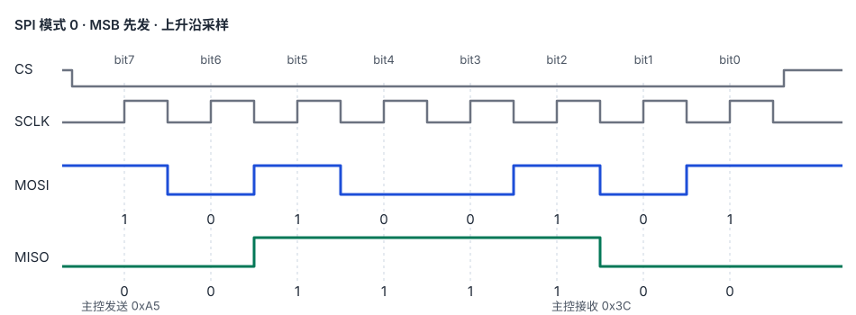
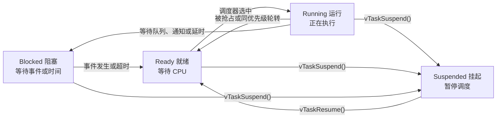

# 嵌入式面试知识点笔记

按主题整理面试经验，涵盖程序内存布局、Cortex-M 寄存器、中断与 HardFault、I2C、SPI、C/C++、FreeRTOS、Linux 进程与线程，以及网络、调试和编程题。建议先掌握 **六大内存分区**，再用 `static`、`malloc`、任务栈等章节把概念串起来；同一知识点的新问题继续补充到对应小节。

[查看实习经历交互页](https://master869.github.io/interview-notes/internship.html) · [查看 SPI 逐拍时序演示](https://master869.github.io/interview-notes/spi-mode0.html)

## 目录

- [六大内存分区](#memory-layout)
  - [一段代码看变量位置](#memory-example) · [各区域的作用](#memory-regions) · [MCU 启动时发生什么](#memory-startup) · [常见追问](#memory-questions)
- [Cortex-M CPU 寄存器](#cortex-m-registers)
  - [R0～R15](#core-registers) · [状态与控制寄存器](#special-registers)
- [中断与中断嵌套](#interrupts)
  - [一次中断的流程](#interrupt-lifecycle) · [中断嵌套](#interrupt-nesting) · [ISR 能做什么](#interrupt-isr-rules) · [ISR 与任务通信](#interrupt-task-communication) · [面试追问](#interrupt-questions)
- [HardFault 定位](#hardfault)
  - [Keil 排查步骤](#hardfault-steps) · [寄存器现场例子](#hardfault-example) · [容易误判的情况](#hardfault-pitfalls)
- [Cache 与 DMA](#cache-dma)
  - [Cache 基础](#cache-basics) · [DMA 与缓存一致性](#dma-coherency)
- [I2C 总线与显示屏通信](#i2c)
  - [基础时序](#i2c-signals) · [7 位地址与设备数量](#i2c-address-count) · [显示屏写入与寄存器读取](#i2c-examples)
- [SPI 通信](#spi)
  - [信号与通信流程](#spi-basics) · [模式 0 时序](#spi-mode0) · [面试常见问题](#spi-questions)
- [UART 串口通信](#uart)
  - [一字节时序与 8N1](#uart-frame) · [接收与业务帧解析](#uart-reception) · [排障要点](#uart-debug) · [面试常见问题](#uart-questions)
- [CRC 校验](#crc)
  - [CRC8、CRC16、CRC32 的区别](#crc-width) · [一次校验怎么完成](#crc-process) · [外设如何配合](#crc-device) · [C 语言 CRC8 示例](#crc-example)
- [智能卡读卡器实习技术](#smartcard-internship)
  - [ThreadX 与任务同步](#threadx-smartcard) · [ISO7816 与 APDU](#iso7816-apdu) · [Flash 参数持久化](#flash-parameters) · [USBX 与 CCID](#usbx-ccid)
- [C/C++ 基础](#c-basics)
  - [`volatile`](#volatile) · [`static`](#static) · [数组指针与指针数组](#array-pointers) · [结构体内存对齐](#struct-alignment) · [`malloc` 与 `free`](#malloc-free)
- [裸机、RTOS 与 Linux](#baremetal-rtos-linux)
- [FreeRTOS](#freertos)
  - [任务调度](#freertos-scheduling) · [任务的四种状态](#freertos-task-states) · [任务切换与保存现场](#freertos-context-switch) · [高优先级任务与饥饿](#freertos-starvation) · [优先级反转](#freertos-priority-inversion) · [怎样满足实时要求](#freertos-realtime) · [任务间通信](#freertos-communication) · [创建任务](#freertos-task-creation) · [检查任务栈](#freertos-stack-check) · [FreeRTOS 与 Linux 的栈](#freertos-linux-stack)
  - [互斥量](#freertos-mutex) · [二值信号量](#freertos-binary-semaphore) · [队列](#freertos-queue)
- [Linux 进程与线程](#linux)
  - [新线程的默认栈大小](#linux-thread-stack-size) · [创建进程](#linux-process-creation) · [创建线程](#linux-thread-creation) · [多线程与多进程](#threads-vs-processes)
- [TCP 服务端建立连接](#tcp-server-connection)
- [嵌入式调试接口排障](#debug-interface)
- [编程题](#coding-problems)
  - [只用 switch case 判断分数](#switch-score) · [合并两个有序链表](#merge-sorted-lists) · [字符串反转](#reverse-string) · [判断大小端](#endianness-code) · [链表区间删除与拼接](#splice-linked-lists) · [判断链表是否有环](#linked-list-cycle) · [简易 malloc/free](#simple-allocator)

<a id="memory-layout"></a>
## 六大内存分区
<!-- TOPIC:memory-layout:START -->

**面试问题：程序的 code、rodata、data、bss、heap、stack 分别存放什么？** 先记住一条主线：**代码和只读常量通常随程序映像保存；有固定生命周期的可写数据在启动时准备好；运行中临时需要的空间由动态分配器或函数调用管理。** 这里说的“六大分区”是常见教学模型，不表示物理内存一定被等分或严格按这个顺序排列；实际布局取决于编译器、链接脚本和平台。

<a id="memory-example"></a>
### 一段代码看变量位置

```c
#include <stdio.h>
#include <stdlib.h>

int global_level = 3;              // 通常在 .data
int global_error;                  // 通常在 .bss
const char screen_name[] = "OLED"; // 通常在 .rodata

void draw_page(void) {             // 函数指令通常在 .text
    static int frames;             // 通常在 .bss，不因函数返回而消失
    int page = 1;                  // 自动局部变量：可能用栈或寄存器
    unsigned char *pixels = malloc(128);
    // pixels 是局部指针；它指向的 128 字节来自动态分配器

    if (pixels == NULL) return;
    pixels[0] = (unsigned char)(global_level + page + frames);
    printf("%s: %u, error=%d\n", screen_name,
           (unsigned)pixels[0], global_error);
    ++frames;
    free(pixels);
}
```

“通常”很重要：C 语言规定对象的行为和生命周期，具体放进哪个节是实现选择；没有被实际使用的对象甚至可能被优化掉。

<a id="memory-regions"></a>
### 六个区域各管什么？

| 区域 | 典型内容 | 生命周期与例子 | 记忆重点 |
| --- | --- | --- | --- |
| **代码区 `.text`** | 函数编译后的机器指令 | 程序运行时可执行；例：`draw_page()` 的指令 | 函数的代码在这里，函数里的变量不因此属于 `.text`。 |
| **只读数据区 `.rodata`** | 常量数据、字符串字面量 | 通常随程序映像存在；例：`screen_name` 的内容 | `const` 不保证对象一定落在 `.rodata`；局部常量也可能被优化为立即数。 |
| **已初始化数据区 `.data`** | 有非零初值、运行时可写的静态存储期对象 | 整个程序运行期间；例：`global_level = 3` | MCU 常在 Flash 保存初值，启动时复制到 RAM。 |
| **零初始化区 `.bss`** | 未显式初始化或初始化为零的静态存储期对象 | 整个程序运行期间；例：`global_error`、`frames` | 程序启动时清零，通常不必在固件映像里逐字节存零。 |
| **堆／动态分配区** | 运行时申请的内存 | 成功申请后至释放前；例：`malloc(128)` 返回的缓冲区 | 申请失败要检查；`free` 后不能继续使用原内存。 |
| **栈** | 调用现场以及通常的局部自动变量 | 随函数调用变化；例：`page`、局部指针 `pixels` | 局部变量可能被放在寄存器；每个 RTOS 任务／Linux 线程有自己的栈。 |

**别把“变量写在函数里”和“变量在栈上”画等号。**`frames` 是函数内的 `static` 变量，却具有静态存储期，函数返回后仍保留值；未初始化时通常在 `.bss`。`pixels` 是局部指针，指针本身通常在栈或寄存器里，所指向的 128 字节才来自动态分配器。Linux 的 `malloc` 实现也可能通过其他内存映射取得空间，不能把“堆”理解为所有动态分配必定落在一块连续区域。[Linux `malloc(3)`](https://man7.org/linux/man-pages/man3/malloc.3.html)

<a id="memory-startup"></a>
### MCU 启动时发生什么？

```text
Flash / ROM                           RAM
┌──────────────────────┐             ┌─────────────────────────┐
│ .text：机器指令       │              │ .data：可写的已初始化数据  │
│ .rodata：只读数据     │              │ .bss：清零后的数据        │
│ .data 的初始值 ───────┼──复制──────→ │                         │
└──────────────────────┘             │ 动态分配区、任务栈等       │
                                     └─────────────────────────┘
```

在常见的 Flash 运行型 MCU 程序中，启动代码先把 `.data` 的初值复制到运行时的 RAM 地址，再把 `.bss` 清零，然后才进入 `main()`。因此 `global_level` 一开始是 `3`，`global_error` 一开始是 `0`。`.data` 的初值通常同时占用固件映像空间和运行时 RAM；`.bss` 主要占用运行时 RAM。具体地址要看链接脚本或 map 文件。[GNU 链接器的 ROM/RAM 示例](https://sourceware.org/binutils/docs/ld.html)

<a id="memory-questions"></a>
### 面试常见追问

1. **`int x = 0` 一定在 `.data` 吗？** 若它是全局变量或静态变量，通常可放在 `.bss`；若它是普通局部变量，则具有自动存储期，不能只凭初值判断为 `.data`。
2. **`static int n` 写在函数里，为什么不是栈变量？**`static` 让它在整个程序运行期间存在；它只初始化一次、跨调用保留值。参见下方 [`static` 小节](#static)。
3. **`malloc` 得到的内存和指针变量各在哪里？** 分配得到的缓冲区属于动态分配；局部指针本身通常在栈或寄存器。参见 [`malloc` 与 `free`](#malloc-free)。
4. **栈满或堆不够会怎样？** 动态分配失败通常以 `NULL` 表示；栈溢出的表现依平台及保护机制而异，在 MCU 上可能破坏其他内存。FreeRTOS 可通过[任务栈高水位](#freertos-stack-check)估算历史最小余量。
5. **这六块在 Linux 中也按图摆放吗？** 不一定。Linux 进程使用虚拟地址空间，还有共享库、内存映射等区域；可查看 `/proc/<pid>/maps` 观察映射，不能把上面的 MCU 示意图当成通用地址表。[Linux `proc_pid_maps(5)`](https://man7.org/linux/man-pages/man5/proc_pid_maps.5.html)

**一句话复述：**`.text` 放指令，`.rodata` 放通常只读的数据，`.data` 放有初值的可写静态数据，`.bss` 放启动时清零的静态数据，动态分配区按需申请，栈跟随函数调用和任务／线程运行。
<!-- TOPIC:memory-layout:END -->

<a id="cortex-m-registers"></a>
## Cortex-M CPU 寄存器
<!-- TOPIC:cortex-m-registers:START -->

以下以常见的 **Cortex-M3/M4/M7** 为例。寄存器是 CPU 内部暂存数据与状态的地方；不同芯片内核的寄存器集合可能不同。`R0`～`R12` 本质上是通用寄存器，表中的“参数”“局部值”等是 **函数调用约定中的常见分工**，并非硬件规定每个寄存器只能做一件事。[Arm Cortex-M4 核心寄存器说明](https://documentation-service.arm.com/static/5f2ac76d60a93e65927bbdc5)；[Arm 32 位函数调用约定](https://github.com/ARM-software/abi-aa/blob/main/aapcs32/aapcs32.rst)

<a id="core-registers"></a>
### R0～R15：数据、栈、返回位置与执行位置

| 寄存器 | 主要作用 | 怎么记 |
| --- | --- | --- |
| `R0` | 常传第 1 个参数，也常放函数返回值；可作临时值。 | 第 1 个参数／返回值。 |
| `R1` | 常传第 2 个参数；某些结果会与 `R0` 一起返回。 | 第 2 个参数。 |
| `R2` | 常传第 3 个参数；也可作临时值。 | 第 3 个参数。 |
| `R3` | 常传第 4 个参数；也可作临时值。 | 第 4 个参数。 |
| `R4` | 常保存需要跨函数调用保留的值。 | 被调用函数用后通常要恢复。 |
| `R5` | 与 `R4` 类似。 | 同上。 |
| `R6` | 与 `R4` 类似。 | 同上。 |
| `R7` | 与 `R4` 类似；某些编译配置也会用它辅助管理栈帧。 | 没有固定“第 7 个变量”。 |
| `R8` | 与 `R4` 类似。 | 值通常跨调用保留。 |
| `R9` | 用途依平台约定：可能保存变量，也可能有平台专用用途。 | 不能一概当普通临时寄存器。 |
| `R10` | 常保存需要跨函数调用保留的值。 | 与 `R4` 类似。 |
| `R11` | 常保存值；某些编译配置用作帧指针。 | 帧指针并非总会启用。 |
| `R12` / `IP` | 临时寄存器；函数调用或链接器生成的跳转代码也可能使用。 | 中转值。 |
| `R13` / `SP` | 当前栈指针；实际有主栈指针 `MSP` 和进程栈指针 `PSP`。 | 栈顶位置。 |
| `R14` / `LR` | 函数返回信息；进入异常后常保存 `EXC_RETURN`。 | 从哪里返回。 |
| `R15` / `PC` | 程序计数器，决定指令执行位置。 | 执行到哪里。 |

例如 `add(2, 3)` 的两个整数参数通常通过 `R0`、`R1` 传入，整数结果通常通过 `R0` 返回；实际安排还取决于参数类型与调用约定。`R0`～`R3`、`R12` 常被调用过程改写；`R4`～`R11` 通常由被调用函数在使用后恢复，但 **`R9` 的约定依平台而定**。[Arm AAPCS32](https://github.com/ARM-software/abi-aa/blob/main/aapcs32/aapcs32.rst)

**为什么有两个 SP？** 线程模式可选择使用 `MSP` 或 `PSP`，处理异常的 Handler 模式使用 `MSP`。RTOS 常让任务使用 `PSP`，异常处理使用 `MSP`；具体以所用系统实现为准。因此调试 HardFault 时，当前看到的 `SP` 不一定指向 **异常发生前** 保存的现场。[Arm 栈指针与异常模式说明](https://documentation-service.arm.com/static/5f2ac76d60a93e65927bbdc5)

<a id="special-registers"></a>
### 状态与控制寄存器

| 寄存器 | 作用 | 排查时关注什么 |
| --- | --- | --- |
| `xPSR` | 程序状态寄存器，由 `APSR`、`IPSR`、`EPSR` 三部分组成。 | 异常前的状态也会进入基本异常栈帧。 |
| `APSR` | 保存运算标志，如 `N`（负）、`Z`（零）、`C`（进位）、`V`（有符号溢出）。 | 条件判断为何跳转。 |
| `IPSR` | 保存当前异常编号。 | `0` 表示线程模式，`3` 表示 HardFault。 |
| `EPSR` | 保存执行状态，例如 Thumb 状态位 `T`。 | 执行状态损坏可能导致故障。 |
| `CONTROL` | 控制线程模式的权限及使用 `MSP`/`PSP`；带 FPU 时还涉及浮点上下文。 | 当前任务使用哪套栈。 |
| `PRIMASK` | 屏蔽所有可配置优先级异常的激活。 | 中断不响应时核对。 |
| `BASEPRI` | 设置优先级屏蔽门槛；`0` 表示不启用该屏蔽。 | RTOS 临界区或中断屏蔽状态。 |
| `FAULTMASK` | 启用时，除 NMI 外的异常都不能激活。 | 是否被意外设置。 |

`APSR`、`IPSR`、`EPSR` 是 `xPSR` 的不同部分，不要误认为三个互不相关的数据寄存器。Cortex-M 的 **优先级数值越小，实际优先级越高**。部分 Cortex-M4/M7 带 FPU，还存在 `S0`～`S31` 等浮点寄存器；是否存在、异常时是否保存浮点现场，要看具体内核和配置。[Arm 状态寄存器与异常屏蔽说明](https://documentation-service.arm.com/static/5f2ac76d60a93e65927bbdc5)

**面试速记：**`R0`～`R12` 处理数据，`SP` 管栈，`LR` 管返回，`PC` 管执行位置，`xPSR` 记录状态，`CONTROL` 选运行方式，三个 MASK 寄存器影响异常屏蔽。`HFSR`、`CFSR`、`BFAR` 等是故障诊断用的 **系统控制寄存器**，放在下面的排障流程里理解。
<!-- TOPIC:cortex-m-registers:END -->

<a id="interrupts"></a>
## 中断与中断嵌套
<!-- TOPIC:interrupts:START -->

以下以常见 **Cortex-M 单片机**为例。中断让 CPU 暂停当前执行路径，优先处理外设或系统事件，处理完再恢复；有 FreeRTOS 时，中断退出后也可能先调度另一个就绪任务。**中断优先级和 FreeRTOS 任务优先级是两套不同的编号。**

<a id="interrupt-lifecycle"></a>
### 一次中断从触发到返回


1. **请求与仲裁：** 例如串口收到数据后置位状态标志，并向 NVIC 请求中断。若中断未使能、被屏蔽，或当前执行着更高抢占优先级的中断，请求暂时处于待处理状态；满足响应条件后才进入。
2. **保存现场：** Cortex-M 硬件在异常入口把 `R0～R3`、`R12`、`LR`、`PC`、`xPSR` 的基本现场压到被打断代码当时使用的栈上。硬件并非自动保存所有寄存器；是否还有浮点现场等，依内核与配置而定。[Arm 异常入口说明](https://documentation-service.arm.com/static/64c7832738511951cb7a246e)
3. **进入 ISR：** CPU 从中断向量表取得处理函数入口，进入 Handler 模式执行；Handler 模式使用 `MSP`。任务若原来用 `PSP`，其被打断的基本现场保存在任务栈上，ISR 自身则使用 `MSP`。[Arm 栈与异常说明](https://documentation-service.arm.com/static/5e8e18c2fd977155116a3d48)
4. **处理事件：** 判断中断源，完成必须立即做的工作，按具体外设手册清除或应答中断标志。如果中断源始终有效且未正确处理，退出后可能立即再次进入。
5. **异常返回：** 异常入口写入 `LR` 的 `EXC_RETURN` 指示返回模式和使用哪套栈；返回时硬件恢复现场，从被打断的位置继续。若还有待处理的中断，Cortex-M 可能采用尾链等机制直接转入下一个 ISR；若 FreeRTOS 因 ISR 唤醒了更高优先级任务，也可能先执行任务切换。[Arm 异常返回说明](https://documentation-service.arm.com/static/5f2ac4ab60a93e65927bbdbf)、[Arm 中断尾链说明](https://documentation-service.arm.com/static/5f2286f2f3ce30357bc28b2a)

<a id="interrupt-nesting"></a>
### 什么是中断嵌套？

**中断嵌套：一个 ISR 尚未结束，被更高抢占优先级的中断打断。** 例如普通任务被串口中断 A 打断；A 处理中又来了优先级更高的故障或定时器中断 B：


进入 B 时要保存 A 的现场；B 返回后先接着执行 A，再返回普通任务。**同一抢占优先级的中断不能仅凭子优先级互相抢占**；子优先级主要决定同级请求同时待处理时谁先执行。Cortex-M 的 NVIC 优先级通常是 **数字越小、逻辑优先级越高**，这与 FreeRTOS 任务优先级不要混淆。嵌套层数增加也会增加 `MSP` 的栈使用量。[FreeRTOS 对 Cortex-M 中断优先级分组的说明](https://freertos.org/Documentation/02-Kernel/03-Supported-devices/04-Demos/ARM-Cortex/RTOS-Cortex-M3-M4)、[Arm 嵌套中断栈说明](https://documentation-service.arm.com/static/5e8e18c2fd977155116a3d48)

<a id="interrupt-isr-rules"></a>
### ISR 能不能调用阻塞函数？

**不能在 ISR 中调用会让任务进入 `Blocked` 的 API，也不能在 ISR 里等待另一个任务释放资源。** ISR 不是普通任务，不能像任务那样挂起、等条件满足后再恢复。若 ISR 一直等某任务，而该任务必须等 ISR 退出才能运行，就可能卡死；耗时 ISR 还会拖延其他中断和任务。

但 ISR 可以使用当前 FreeRTOS 移植允许的、**不会阻塞的 `...FromISR` API**。例如串口 DMA 完成中断只清标志、调用 `xSemaphoreGiveFromISR()` 或任务通知，接收任务醒来后再解析数据；详见 [二值信号量示例](#freertos-binary-semaphore)。若唤醒了更高优先级任务，可按移植要求请求中断退出后调度。**在使用 `configMAX_SYSCALL_INTERRUPT_PRIORITY` 的 Cortex-M 移植中，即使是 `...FromISR` API，也只能从符合该优先级门槛的 ISR 调用；超过门槛的高优先级中断不能直接调用这些内核 API。** [FreeRTOS Cortex-M 中断规则](https://freertos.org/Documentation/02-Kernel/03-Supported-devices/04-Demos/ARM-Cortex/RTOS-Cortex-M3-M4)

<a id="interrupt-task-communication"></a>
### ISR 与任务怎么通信？

核心做法是 **ISR 通知或交出数据，任务等待并完成后续处理**；不要让 ISR 自己等待任务。选哪种机制取决于要传的内容：

| 需求 | 常用方式 | 例子 |
| --- | --- | --- |
| 只通知“完成了” | `vTaskNotifyGiveFromISR()`；或二值信号量 | DMA 收完一块数据，唤醒解析任务。 |
| 传一条具体消息 | `xQueueSendFromISR()` | 按键中断把按键编号交给界面任务。 |
| 传连续字节 | 流缓冲区，或 DMA 缓冲区加完成通知 | 串口接收数据，任务解析协议。 |
| 只保留最新状态 | 同步保护的共享状态加通知，或通知值覆盖旧值 | 显示屏只需最新温度，不必处理每次旧读数。 |

**DMA 接收完成例子：** 先创建接收任务、保存 `rxTaskHandle`，再使能 DMA 中断。以下函数名只表示驱动操作，要替换为实际芯片的实现；假设接收完成后 DMA 不会继续改写这块缓冲区。

```c
static TaskHandle_t rxTaskHandle;

void DMA_RX_IRQHandler(void) {
    BaseType_t needSwitch = pdFALSE;

    if (DmaRxComplete()) {
        ClearDmaRxInterrupt();
        vTaskNotifyGiveFromISR(rxTaskHandle, &needSwitch);
    }
    portYIELD_FROM_ISR(needSwitch);
}

void RxTask(void *arg) {
    for (;;) {
        if (ulTaskNotifyTake(pdTRUE, portMAX_DELAY) > 0) {
            ParseRxBuffer();   /* 在任务中解析，不在 ISR 中解析。 */
            StartNextDmaRx();  /* 处理完后才复用这块缓冲区。 */
        }
    }
}
```

接收任务原本阻塞等待；ISR 清中断标志并发通知后尽快退出；接收任务先变成 `Ready`，被调度后才解析。通知本身 **不会复制 DMA 缓冲区**，任务读取期间要防止下一次 DMA 覆盖它。`portYIELD_FROM_ISR()` 的名称和要求依移植而定；只有被唤醒的任务应尽快抢占时才需要请求切换。队列、二值信号量、互斥量各自适用的场景见 [FreeRTOS 任务间通信](#freertos-communication)。[FreeRTOS ISR 任务通知示例](https://freertos.org/Documentation/02-Kernel/04-API-references/05-Direct-to-task-notifications/02-vTaskNotifyGiveFromISR)、[中断中发送队列消息](https://www.freertos.org/media/2018/FreeRTOS_Reference_Manual_V10.0.0.pdf)

<a id="interrupt-questions"></a>
### 常见面试追问

| 问题 | 回答要点 |
| --- | --- |
| 中断为什么要尽量短？ | 缩短其他中断及任务的等待时间；复杂计算、解析、打印通常放到被通知的任务中。 |
| 进入 ISR 就一定发生任务切换吗？ | 不一定；进入中断先保存被打断的现场，ISR 退出后调度器也可能继续选择原任务。任务上下文切换见 [任务切换与保存现场](#freertos-context-switch)。 |
| 中断与任务共用变量怎么处理？ | 核对访问是否原子、是否会读到一半更新的内容，必要时使用临界区或消息传递；`volatile` 不能代替同步，见 [`volatile` 章节](#volatile)。 |
| ISR 怎样把工作交给任务？ | 用符合中断优先级要求的 `...FromISR` API 通知或发送消息；任务等待并完成耗时工作，见 [ISR 与任务通信](#interrupt-task-communication)。 |
| 为什么中断退出后又立刻进来？ | 排查外设中断标志是否正确清除、触发条件是否仍然有效，以及是否有新的待处理请求。 |
| 中断优先级设得越高越好吗？ | 不是；高优先级会增加低优先级中断的等待，并影响 FreeRTOS API 能否从该 ISR 调用。 |

**面试速记：** 外设请求 → NVIC 仲裁 → 硬件保存现场 → 向量表进入 ISR → 处理并清中断源 → 异常返回；更高抢占优先级的中断可在 ISR 中间插入，处理完先回原 ISR。ISR 不做任务式阻塞等待，耗时工作交给任务。
<!-- TOPIC:interrupts:END -->

<a id="hardfault"></a>
## HardFault 定位
<!-- TOPIC:hardfault:START -->

**面试问题：程序偶发跑进 HardFault，加 `printf` 后 Bug 不复现，手头只有 Keil IDE，怎么定位？**`printf` 可能改变执行时序、栈占用和内存布局；故障暂时消失不等于已经修复。思路是 **尽量保持原程序运行，故障发生时停住并保存现场，再从症状追到根因**。

<a id="hardfault-steps"></a>
### 在 Keil 中按什么顺序查？

1. **停在现场。** 用原来的固件运行，在 `HardFault_Handler` 入口设断点；故障发生后先记录寄存器和栈，不急着复位，也不加大量打印。Keil 的 **Peripherals → Core Peripherals → Fault Reports** 可以查看故障状态；不支持该窗口时，也可在寄存器或内存窗口读相应寄存器。[Keil 故障调试说明](https://www.keil.com/appnotes/files/apnt209.pdf)
2. **先看故障类型。**`HFSR.FORCED=1` 表示其他故障升级为 HardFault，要继续看 `CFSR`。`CFSR` 汇总内存管理、总线和用法故障；只有 `BFARVALID` 或 `MMARVALID` 置位时，相应的 `BFAR` 或 `MMFAR` 才能当故障地址使用。[Arm 故障寄存器定义](https://documentation-service.arm.com/static/5f2ac76d60a93e65927bbdc5)
3. **选对异常前使用的栈。** 处理函数中的 `LR` 是 `EXC_RETURN`：其 bit2 为 `0`，查看 `MSP`；为 `1`，查看 `PSP`。常见基本返回值 `0xFFFFFFF9` 对应 MSP，`0xFFFFFFFD` 对应 PSP。Keil 的 Registers、Memory 窗口可查看这些值。[Keil 异常栈帧示例](https://www.keil.com/appnotes/files/apnt209.pdf)
4. **找保存的 PC 和操作数。** 若确认是 **有效的基本异常栈帧**，从选中的栈指针指向处依次为 `R0、R1、R2、R3、R12、原 LR、PC、xPSR`；保存的 `PC` 在 `SP + 24` 字节处。将这个 PC 放到 Disassembly 窗口，结合 `.axf` 的源码定位、寄存器值与调用关系分析。处理函数里当前显示的 PC 指向处理函数本身，不能拿它当异常前的执行位置。Keil 的 **Call Stack + Locals → Show Caller Code** 也可辅助定位。[Arm 基本异常栈帧](https://documentation-service.arm.com/static/5f2ac76d60a93e65927bbdc5)；[Keil 窗口操作](https://www.keil.com/appnotes/files/apnt209.pdf)
5. **追查上游并验证。** 若指令只是使用了已损坏的指针，出错位置可能是 **更早写坏指针** 的代码。检查数组越界、任务或中断栈溢出、函数指针、并发访问与初始化时序；对可疑变量设置硬件数据断点，观察是谁改写了它。修复后用 **原来的时序和负载** 复现验证。

```text
有效基本异常栈帧（地址从低到高）
SP+0   R0     SP+4   R1     SP+8   R2     SP+12  R3
SP+16  R12    SP+20  原 LR  SP+24  原 PC  SP+28  xPSR
                                 ↑ 用它找异常前执行的位置
```

<a id="hardfault-example"></a>
### 通俗例子：PC 找到“撞墙处”，再找“谁把方向盘拨歪”

假设 `send_display()` 中有 `*data_ptr = 0x55;`。某次运行时，`data_ptr` 被更早的代码错误改成 `0xDEAD0000`；**假设该地址在这颗 MCU 上不可访问**。程序执行写入时进入 HardFault，现场可能是：

```text
HFSR       = 0x40000000   → FORCED：其他故障升级为 HardFault
CFSR       = 0x00008200   → PRECISERR + BFARVALID：精确总线错误，地址有效
BFAR       = 0xDEAD0000   → 发生错误的访问地址
EXC_RETURN = 0xFFFFFFFD   → 异常前使用 PSP
保存的 PC   = 写入语句对应的 STR 指令地址
```

于是先从 PSP 的 **有效基本栈帧** 取出保存的 PC，确认它对应哪条写指令；再看该指令使用的基址寄存器，发现其中是 `0xDEAD0000`。这能说明“在这里访问坏地址”，却 **还不能说明是谁把指针改坏**。下一步应沿 `data_ptr` 的赋值和生命周期往前查，或对它设置数据断点。若越界写入或任务竞争是根因，加 `printf` 恰好改变了内存布局或时序，就可能让故障暂时消失。以上数值是讲解步骤的 **假设现场**，实际读数随芯片和问题变化。

<a id="hardfault-pitfalls"></a>
### 容易误判的情况

- **保存的 PC 不一定就是肇事指令。**`CFSR` 若显示 `IMPRECISERR`，总线错误可能延后才报告，保存的 PC 与最初引发错误的指令无关；此时应扩大排查范围，必要时用芯片和调试器支持的指令追踪。[Arm 对精确与非精确总线错误的定义](https://documentation-service.arm.com/static/5f2ac76d60a93e65927bbdc5)
- **异常栈帧未必可按固定偏移读。** 带 FPU 的扩展帧、压栈本身出错、栈越界或已经被覆盖时，要先核对现场是否完整；不能机械读取 `SP + 24`。[Arm 异常栈帧说明](https://documentation-service.arm.com/static/5f2ac76d60a93e65927bbdc5)
- **不要只看调用栈最上面。** 它往往只是 `HardFault_Handler`；需要结合异常前的 PC、故障状态、地址和寄存器操作数。若调试器的调用栈不完整，就直接看 Memory 和 Disassembly 窗口。
- **内核型号要先确认。** 上面的 `CFSR/HFSR` 及示例主要针对 Cortex-M3/M4/M7；Cortex-M0/M0+ 可用的故障状态寄存器不同，不能照搬。

**面试简答：**“我会先保持原固件，在 HardFault 入口断住，查看 `HFSR/CFSR`；用 `EXC_RETURN` 判断异常前的现场在 MSP 还是 PSP，从有效栈帧里取出保存的 PC，再结合反汇编、故障地址和操作数定位。找到触发故障的指令后，我会追查指针何时被改坏或栈何时溢出，必要时用硬件数据断点，而不是靠增加 `printf` 碰运气。”
<!-- TOPIC:hardfault:END -->

<a id="cache-dma"></a>
## Cache 与 DMA
<!-- TOPIC:cache-dma:START -->

**面试问题：Cache 是什么？它与 RAM、DMA 和 `volatile` 有什么关系？**

<a id="cache-basics"></a>
### Cache 基础

**Cache（高速缓存）是 CPU 附近保存数据或指令副本的小容量高速存储**，目的是减少访问较慢内存的等待。CPU 要读某地址时，若其内容已经在 Cache 中，就是 **命中**；否则是 **未命中**，需要从更远的内存取入。讨论 DMA 时，主要关心数据 Cache（D-Cache）。Cache 不是 `.text`、`.data`、堆、栈之外的“第七个程序分区”：这些名称描述程序内容及其生命周期，Cache 则是硬件对其中部分内容保存的临时副本。[Arm 对 Cache 与一致性的介绍](https://developer.arm.com/community/arm-community-blogs/b/architectures-and-processors-blog/posts/exploring-how-cache-coherency-accelerates-heterogeneous-compute)

```text
CPU 寄存器：当前参与计算的少量值
      ↕
CPU 数据 Cache：近期访问的数据副本
      ↕
RAM：程序运行时存放的大量数据
```

**Cache 按“缓存行”管理数据，而非只处理一个字节。** 例如某平台一行是 32 字节，读取一个字节时可能把它所在的整行取进 Cache；32 字节只是示例，实际大小看芯片手册。后续对 DMA 缓冲区执行缓存维护时，要考虑行对齐，以及缓冲区是否与其他变量共享同一行，否则可能影响邻近数据。[Linux DMA 指南](https://docs.kernel.org/core-api/dma-api-howto.html)

<a id="dma-coherency"></a>
### DMA 与缓存一致性

DMA 让外设与内存交换数据时无需 CPU 逐字节搬运；CPU 通常负责配置传输、处理完成事件等工作。在使用 **回写式（write-back）** 数据 Cache 的平台上，CPU 修改缓冲区后，新值可能暂时只在 Cache，RAM 仍是旧值。这一行称为 **脏行**。`clean` 将脏数据写回到 DMA 等设备可见的位置；`invalidate` 则使旧副本失效，让 CPU 下次重新取数据。直接丢弃仍含有未写回修改的脏行可能丢数据，因此操作顺序必须遵循芯片或驱动文档。下表只讨论 **CPU Cache 与 DMA 不自动保持一致** 的平台。[Arm 缓存维护说明](https://documentation-service.arm.com/static/684be32a3f793d5d7b223563)

| 传输方向 | 可能发生的旧数据问题 | 交接缓冲区时的典型处理 |
| --- | --- | --- |
| **CPU 写，DMA 读**，如 CPU 准备显示数据后由 I2C DMA 发送 | 新数据还在 CPU Cache，DMA 从 RAM 读到旧数据 | DMA 开始前，按平台要求对发送缓冲区执行 **clean**。 |
| **DMA 写，CPU 读**，如 UART DMA 接收数据 | RAM 已更新，CPU 却命中 Cache 中的旧副本 | DMA 完成、CPU 读取前，按平台要求对接收缓冲区执行 **invalidate**；有些平台还要求在 DMA 开始前处理该缓冲区。 |

```text
发送例子：CPU 把 buffer[0] 改为 0xFF → 新值暂留 Cache
          DMA 若直接从 RAM 读到旧值 0x00 → 屏幕收到错误数据

接收例子：DMA 把 RAM 中 buffer[0] 改为 0x5A
          CPU 若从旧 Cache 读到 0x00 → 误以为没有新数据
```

**不是所有项目都要手工清理 Cache。** 有的 MCU 没有启用 D-Cache；有的平台由硬件保证 CPU 与 DMA 一致；若 [I2C 显示屏](#i2c)由 CPU 直接写外设寄存器、没有使用 DMA 缓冲区，也不会按上述方式出现“DMA 读到旧缓冲区”的问题。在 Linux 驱动中应使用 DMA 映射与同步 API，让平台实现处理缓存一致性；裸机或 RTOS 下则遵循芯片手册和驱动要求。[Arm Cortex-M7 缓存维护操作](https://documentation-service.arm.com/static/61efd6602dd99944d051417b?token=)；[Linux DMA API 指南](https://docs.kernel.org/core-api/dma-api-howto.html)

**与 [`volatile`](#volatile) 区分：**`volatile` 约束编译器对对象访问的优化，不会自动把 Cache 中的脏数据写回，也不会让旧缓存行失效。因此遇到 DMA 旧数据问题，单纯给缓冲区加 `volatile` 不能代替正确的缓存同步。
<!-- TOPIC:cache-dma:END -->

<a id="i2c"></a>
## I2C 总线与显示屏通信
<!-- TOPIC:i2c:START -->

下面用 **SSD1306 I2C OLED** 做写入示例。假设屏幕的 **7 位地址是 `0x3C`**，那么“地址 + 写位 `0`”组成的总线地址字节就是 **`0x78`**（`0x3C << 1`）。屏幕的实际地址可能不同；调用 I2C 驱动时，也要确认 API 要求传入 7 位地址还是已左移的地址字节。

I2C 的 ACK 与设备协议中的 [CRC 校验](#crc)是不同的概念；是否带 CRC 字节由具体器件手册决定。

<a id="i2c-signals"></a>
### 基础时序：先记住四个信号

- **START（起始）**：SCL 为高时，主控让 SDA 从高变低。
- **数据位**：每个字节按最高位到最低位发送；SCL 为高时，SDA 保持稳定，通常在 SCL 为低时改变。
- **ACK/NACK（应答）**：8 位数据之后还有第 **9 个 SCL 脉冲**。接收方拉低 SDA 是 ACK，保持高电平是 NACK。
- **STOP（停止）**：SCL 为高时，主控让 SDA 从低变高。

<a id="i2c-address-count"></a>
### 7 位地址为什么不是 8 位？一条总线能接多少设备？

**面试问题：为什么是 `2^7` 而不是 `2^8`？“127 个设备”怎么算？**

常见的 7 位寻址格式中，START 后发送的第一个字节由 **7 位设备地址 + 1 位 R/W 方向位** 组成。方向位不能算作设备地址，所以 7 位地址共有 `2^7 = 128` 种组合；`0x3C` 这个屏幕地址加写位 `0` 后形成总线字节 `0x78`。按地址格式计算，读位 `1` 会形成 `0x79`，并不代表另一台设备；这只是在解释地址格式，实际设备能否读要看手册。

“127 个设备”不是 I2C 的通用上限：它通常只扣除了 `0x00`，却忽略其他保留地址。按标准普通 7 位设备地址范围 `0x08`～`0x77` 计算，常规可分配地址有 **112 个**（128 减去首尾各 8 个保留地址）。这仍只是地址数量；实际可挂设备数还受地址冲突、总线电容、上拉电阻与速率等条件限制。某些保留地址有特定用途，不能简单当作普通设备地址使用。

参考：[NXP I2C 总线规范 UM10204，保留地址表](https://www.nxp.com/docs/en/user-guide/UM10204.pdf)。

<a id="i2c-examples"></a>
### 显示屏写入与寄存器读取示例

下面的图按 **从上到下** 的顺序画出同一次事务。每一行字节波形都包含 8 位数据和第 9 拍应答；蓝色是 SDA，灰色是 SCL。

#### 例 1：向 SSD1306 发送“打开显示”命令

```text
START → 0x78 → ACK → 0x00 → ACK → 0xAF → ACK → STOP
         地址+写位       控制字节       显示开启命令
```

`0x00` 是 **控制字节**，告诉 SSD1306 后面的内容按“命令”解释；`0xAF` 才是“打开显示”的命令。三个 ACK 都由 **屏幕** 在各自的第 9 个时钟拉低 SDA 发出。


#### 例 2：向 SSD1306 写入一个显示数据字节

```text
START → 0x78 → ACK → 0x40 → ACK → 0xFF → ACK → STOP
         地址+写位       控制字节       显示数据
```

`0x40` 也是 **控制字节**，这次表示后续内容是写入显存的数据。`0xFF` 的 8 位都是 `1`，对应当前显存列中一页的 8 个垂直像素位。它落在屏幕上的具体位置，取决于此前设置的寻址模式、页地址和列地址；发送多个数据字节时，可以在同一次事务中继续写。


**容易混淆：** 例 1 的 `0x00` 与例 2 的 `0x40` 都是控制字节；同一个十六进制值在不同位置可能有不同含义，必须结合前面的控制字节解释。

#### 例 3：设备支持读取时，怎样读寄存器？

这是 **通用读流程示意，不是 SSD1306 显存回读**。为方便看每一位，假设另一台可读设备的 7 位地址为 `0x2A`、寄存器地址为 `0x10`，且读出的值为 `0x5A`：

```text
START → 0x54(地址+写) → ACK → 0x10(寄存器地址) → ACK
      → 重复 START → 0x55(地址+读) → ACK → 0x5A(设备发数据) → NACK → STOP
```

前半段的“写”只是告诉设备 **想读哪个寄存器**，没有发 STOP，而是用重复 START 切换到读。读出最后一个字节后，**主控** 在第 9 拍保持 SDA 为高，回 NACK 表示“读完了”，然后发 STOP。


**SSD1306 的 I2C 串行接口不提供显存数据回读。** 如果你的显示屏项目确实会从屏幕读取数据，请先确认控制器型号及手册中可读的寄存器；读命令、地址和应答方式要以实际控制器为准。

#### 读图时抓住这三点

1. **SCL 高电平期间 SDA 发生下降或上升**，分别表示 START 或 STOP；普通数据位此时应保持不变。
2. **每发完 8 位就看第 9 拍**：写事务中通常由屏幕回 ACK；读事务中数据由设备发，最后一个字节通常由主控回 NACK。
3. **地址和负载要分开看**：`0x3C` 是 7 位设备地址，`0x78` 是加上写位后的总线字节；`0x00`/`0x40` 决定 SSD1306 怎样解释后面的字节。

参考：[SSD1306 数据手册，第 8.1.5 节（I2C 接口）及命令表](https://files.waveshare.com/upload/a/af/SSD1306-Revision_1.1.pdf)。
<!-- TOPIC:i2c:END -->

<a id="spi"></a>
## SPI 通信
<!-- TOPIC:spi:START -->

SPI 是 **由主控提供时钟的同步串行通信**。以常见的四线连接为例，一次时钟传输中，主控经 MOSI 发出一位，同时从 MISO 收到一位；具体设备也可能只接一根数据线、只写或只读。SPI 没有像 I2C 那样统一的设备地址字节、START/STOP 和每字节第 9 拍 ACK；**命令格式、读写位、寄存器地址和片选时序由设备手册规定**。

<a id="spi-basics"></a>
### 四根常见信号与一次通信流程

| 信号 | 方向 | 作用 |
| --- | --- | --- |
| `SCLK` / `SCK` | 主控 → 从设备 | 主控产生时钟；双方按约定的边沿改变、采样数据。 |
| `MOSI` | 主控 → 从设备 | 主控发送的数据。 |
| `MISO` | 从设备 → 主控 | 从设备返回的数据；具体设备可能没有这根线。 |
| `CS` / `SS` | 主控 → 从设备 | 选择从设备；常见为低有效，但要以设备手册为准。 |

常见流程是：**配置模式、位序和时钟频率 → 选中设备（CS 有效）→ 产生时钟并逐位交换数据 → 等最后一位传完 → 释放 CS**。CS 有效前后的建立时间、保持时间，以及命令和数据之间是否允许释放 CS，都要看器件手册。多个设备可以共享时钟和数据线，但通常各有片选；未被选中的设备一般不应驱动共享的 MISO。

**CPOL 决定时钟空闲电平，CPHA 决定在前沿还是后沿采样。**“前沿”是从空闲电平离开的第一个边沿，可能是上升沿，也可能是下降沿。

| 模式 | CPOL | CPHA | SCLK 空闲 | 采样边沿 | 改变下一位的边沿 |
| --- | ---: | ---: | --- | --- | --- |
| 0 | 0 | 0 | 低 | 上升沿 | 下降沿 |
| 1 | 0 | 1 | 低 | 下降沿 | 上升沿 |
| 2 | 1 | 0 | 高 | 下降沿 | 上升沿 |
| 3 | 1 | 1 | 高 | 上升沿 | 下降沿 |

主控与设备的模式、位序和可接受的时钟频率必须匹配。表中的“改变”是便于读时序图的典型表述；尤其在 **CPHA=0** 时，**第 1 位必须在第一个采样边沿之前就准备好**，不能等第一个下降沿才放上去。[Analog Devices：SPI 接口与四种模式](https://www.analog.com/en/resources/analog-dialogue/articles/introduction-to-spi-interface.html)

<a id="spi-mode0"></a>
### 模式 0：一边发 `0xA5`，一边收 `0x3C`

下面假设 **CS 低有效、MSB 先发、CPOL=0、CPHA=0**，且从设备恰好返回 `0x3C`。主控发送 `0xA5 = 1010 0101`，从设备发送 `0x3C = 0011 1100`。这是演示收发时序的 **假设数据**，实际返回什么由设备协议及当前状态决定。



**[打开可逐拍查看的交互时序图](https://master869.github.io/interview-notes/spi-mode0.html)**（网页启用后可直接使用；[页面源码](docs/spi-mode0.html)也可下载后在浏览器中打开）。

1. **CS 拉低。** 主控选中目标设备，SCLK 此时保持低电平。主控先把 MOSI 的最高位 `1` 放好；从设备也应按其协议准备 MISO 的首位 `0`。
2. **第 1 个上升沿。** 主控采样 MISO 的 bit7=`0`，从设备采样 MOSI 的 bit7=`1`。随后下降沿到来，双方准备 bit6。
3. **重复到第 8 拍。** 每个上升沿双方各采一位，因此一字节需要 **8 个 SCLK 周期**；发送与接收是在同一组时钟内同时发生的。
4. **收尾。** 第 8 位传完且满足器件时序要求后，主控释放 CS。此时主控发送了 `0xA5`，接收移位寄存器得到 `0x3C`。

这张图中的 MISO 数据只是举例。**SPI “发送时也在接收”，不等于每次接收的字节都有用。** 很多设备在收到读命令和地址后，主控还需要发送占位字节（常见为 `0x00` 或 `0xFF`，按器件要求），继续产生 SCLK，设备才会在 MISO 上送出目标数据。也有设备需要等待周期；具体看数据手册。

<a id="spi-questions"></a>
### 面试常见问题

1. **SPI 为什么说是全双工？** 典型四线 SPI 有独立的 MOSI、MISO；每个时钟周期双方可以各传一位。某些设备或工作模式只有单向数据线，不能把“全双工”套到所有 SPI 器件上。
2. **模式 0 在哪个边沿采样？** SCLK 空闲低；上升沿采样，下降沿为下一位做准备。第一位须在 **第一个上升沿之前** 稳定。
3. **CPOL 与 CPHA 配错会怎样？** 一方可能在另一方改变数据的边沿采样，造成读值错位或不稳定。排查时同时核对模式、位序、CS 时序和最高 SCLK 频率。
4. **SPI 读寄存器为什么还要“发送”数据？** 时钟由主控产生；为了让从设备继续输出，主控需要继续触发传输。占位字节的值及有效返回数据从第几字节开始，都按具体设备协议判断。
5. **SPI 有地址和 ACK 吗？** 常见 SPI 没有 I2C 式总线地址与每字节 ACK。CS 选择设备；器件自己的命令中可以包含地址或状态响应，但那属于该器件协议。
6. **传完一个字节就拉高 CS 吗？** 不一定。一条命令可能包含命令字、地址、等待字节和数据，可能要求整段期间 CS 一直有效；还要等待最后一位真正移出，不能只看发送缓冲区已写入。
7. **SPI 比 I2C 快就一定更合适吗？** 不一定。SPI 通常布线和片选更多，缺少统一的寻址和 ACK；I2C 只需共享两根信号线，适合多个低速设备。选择取决于带宽、引脚、布线、设备协议等要求。

参考：[Analog Devices：SPI 基础、全双工与模式表](https://www.analog.com/en/resources/analog-dialogue/articles/introduction-to-spi-interface.html)；[Microchip：SPI 时钟模式说明](https://onlinedocs.microchip.com/oxy/GUID-76938A18-C47D-4351-9D02-463E8A957829-en-US-8/GUID-D8B41778-0B24-41AB-AB85-5F5130FB7D87.html)。
<!-- TOPIC:spi:END -->

<a id="uart"></a>
## UART 串口通信
<!-- TOPIC:uart:START -->

UART 是常见的**异步串行收发**方式。典型连接是设备 A 的 TX 接设备 B 的 RX、A 的 RX 接 B 的 TX，并共地；双方预先约定波特率、数据位、校验位和停止位。与 [I2C](#i2c) 的共享总线寻址、[SPI](#spi) 的主控时钟和片选不同，常见 UART 链路没有共享时钟线，也没有统一的设备地址或每字节 ACK。它只负责逐字节收发，**业务命令的边界和格式由上层协议规定**。

<a id="uart-frame"></a>
### 一字节时序与 8N1

线路空闲通常为高电平；起始位拉低线路，接收方据此确定采样时机；随后传数据位（常见为低位先发），可选奇偶校验位，最后是高电平停止位。常见的 **115200 8N1** 表示波特率 115200、8 位数据、无奇偶校验、1 位停止位。[Microchip UART 参考手册](https://ww1.microchip.com/downloads/aemDocuments/documents/OTH/ProductDocuments/ReferenceManuals/60001107H.pdf)

```text
空闲  起始位       8 个数据位（低位先发）         停止位
  1  │  0  │ d0 d1 d2 d3 d4 d5 d6 d7 │    1
```

8N1 每传 1 字节有效数据，线路上要发 **1+8+1=10 位**。因此 115200 波特率下，理论上最多约 `115200 / 10 = 11520` 字节/秒；再扣除上层协议字段、设备处理等，实际有效载荷速率会更低。一字节的线路时间约 `10 / 115200 ≈ 86.8 μs`。波特率相同并不意味着实际采样时刻绝对相同，两端时钟误差过大仍可能造成接收错误。[Microchip 串口调试指南](https://ww1.microchip.com/downloads/aemDocuments/documents/MCU08/ApplicationNotes/ApplicationNotes/TB3331-Debug-SerialInterf-EmbeddedSystems-DS90003331.pdf)

<a id="uart-reception"></a>
### 接收与业务帧解析

| 接收方式 | 适用情况 | 需要注意 |
| --- | --- | --- |
| 轮询 | 数据很少、流程简单 | 等待期间占用 CPU，容易影响别的工作。 |
| 接收中断 | 字节到来就及时处理 | 中断中尽量只取数据、放入缓冲区并通知任务，不做耗时解析。 |
| DMA | 持续或较大量的数据 | 管理缓冲区写入位置、回绕及覆盖；核对半满、满和空闲事件。 |

**UART 硬件的起始位/停止位只界定一个字符，不界定一条多字节业务消息。**例如设备协议可定义 `[帧头][长度][命令/数据][CRC]`；接收方逐字节状态机依次找帧头、读长度、收够数据、校验后交给业务任务。长度必须限幅；半帧要保留状态，超时或错误时要重新同步。帧头若也允许出现在负载中，使用长度字段后不应把负载里的同值字节误认成新帧头；若协议用结束符定界，则要考虑转义。[Microchip UART 命令帧示例](https://onlinedocs.microchip.com/oxy/GUID-58904FDA-338A-488F-A88D-766D29B27E37-en-US-1/GUID-EF0E0992-17AA-46DD-85CB-826FA2545D10.html)

STM32 等平台有“接收到空闲”相关中断/DMA API，可用来通知软件处理**当前已收到的字节**；空闲只表示出现了时间间隔，**不能脱离协议就认定是一帧结束**。DMA 回调给出的长度还要按所用 HAL 版本和接收模式解释。[ST UART Receive-to-Idle 文档](https://dev.st.com/stm32cube-docs/stm32c5xx-hal-drivers/2.0.0/en/docs/drivers/hal_drivers/uart/api/hal_uart_exported_functions.html)

<a id="uart-debug"></a>
### 收不到、乱码、丢字节怎么排查？

1. **先查电气连接：** TX/RX 是否交叉、是否共地、收发器与电平是否匹配。MCU 的 UART 引脚、RS-232 和 RS-485 不是可直接互接的同一种电气接口；后两者通常需要相应收发器。
2. **再查配置：** 波特率、数据位、校验位、停止位是否一致；检查实际时钟和示波器/逻辑分析仪上的位时间。
3. **看错误状态：** 帧错误、奇偶校验错误、噪声错误或接收溢出（overrun）有不同含义。接收处理不及时、FIFO/软件缓冲区满时可能丢字节；必要时调整缓冲区、DMA 和流控。错误标志的清除方式按芯片手册处理。[Microchip 接收错误标志](https://onlinedocs.microchip.com/oxy/GUID-173AD72D-41FE-4760-A93C-7078A02BD908-en-US-7.1.1/GUID-7B4385C0-7B06-44CC-B8BC-07E8CDDB8721.html)
4. **最后查协议：** 是否取错 DMA 缓冲区位置、漏了数据、长度字段解释错、校验不一致，或把一次接收回调误认为一整帧。数据完整性可按设备协议使用 [CRC](#crc)。

<a id="uart-questions"></a>
### 面试常见问题

1. **UART 为什么不需要时钟线？**双方约定波特率，接收方利用起始位定位后续数据位的采样时机；因此时钟误差不能过大。
2. **UART 是全双工吗？**典型 TX/RX 独立的连接可同时收发；具体能力仍取决于芯片、引脚和外部线路模式。
3. **UART 与 USART 有什么区别？**USART 常表示外设还能支持同步工作方式；具体支持哪些模式，以目标芯片手册为准。
4. **奇偶校验能替代 CRC 吗？**不能。奇偶校验只增加一个字符级校验位，可检测某些位错误，但不能保证发现所有错误；多字节业务帧按协议另做 CRC 或其他校验。
5. **为什么发送缓冲区空了还不能立刻关闭发送器？**“可以再写下一字节”和“最后一位已从引脚移出”是两个不同状态。控制 RS-485 方向脚时，应等发送完成标志，而不是只看缓冲区空。[Microchip 发送标志说明](https://onlinedocs.microchip.com/oxy/GUID-0EC909F9-8FB7-46B2-BF4B-05290662B5C3-en-US-12.1.1/GUID-8B7DDFC1-10E0-447C-9276-A5BEE9BABDD3.html)
6. **RTS/CTS 用来做什么？**硬件流控让接收方在缓冲区接近满时提示发送方暂缓，避免处理速度跟不上而丢数据；是否可用取决于双方硬件和配置。[Microchip 硬件流控说明](https://onlinedocs.microchip.com/oxy/GUID-167CA20A-2C0F-4CBC-A693-9FD032B9B193-en-US-1/GUID-C8B83E54-0F62-4205-98DD-B1560AACDBB4.html)
7. **UART 传输距离能给一个固定数字吗？**不能。UART 规定收发格式；可用距离取决于电气接口、线缆、波特率、干扰、接地等条件，不能把 MCU 引脚直连和 RS-485 收发器的距离混为一谈。

**面试概括：**先讲 8N1 的字节时序，再讲轮询/中断/DMA 如何接收，随后说明业务帧必须由上层协议定义，最后按电气、配置、错误标志、协议四层排查故障。
<!-- TOPIC:uart:END -->

<a id="crc"></a>
## CRC 校验
<!-- TOPIC:crc:START -->

**CRC（循环冗余校验）用来发现数据在传输或存储时是否发生变化。**发送方按约定算法计算校验值，把它与数据一起发送；接收方对收到的数据重新计算，再与收到的校验值比较。不相同就判为校验失败；相同表示**通过这次检错**，并不保证数据绝对正确。CRC 本身不能修复数据，也不能代替加密或身份认证。

<a id="crc-width"></a>
### CRC8、CRC16、CRC32 有什么区别？

| 名称 | 校验值宽度 | 附加开销 | 常见例子 |
| --- | --- | --- | --- |
| CRC8 | 8 位 | 1 字节 | SMBus 的 PEC、部分传感器报文 |
| CRC16 | 16 位 | 2 字节 | Modbus 串行通信等 |
| CRC32 | 32 位 | 4 字节 | 较大数据块、文件或固件数据的检错 |

**数字表示校验值长度，不表示原始数据长度。**1 字节的数据也能按协议使用 CRC16；多个字节的数据也能使用 CRC8。校验值越长，附加开销越大；实际检错能力还取决于**多项式、报文长度和错误模式**，不能只看 8、16、32。[SMBus 规范](https://smbus.org/specs/SMBus_3_3_1_20241020.pdf)；[Modbus 串行规范](https://www.modbus.org/modbus-specifications)；[CRC 多项式研究](https://users.ece.cmu.edu/~koopman/roses/dsn04/koopman04_crc_poly_embedded.pdf)

**只说“使用 CRC16”还不足以让双方算出相同结果。**通信双方至少要核对校验宽度、生成多项式、初始值、输入/输出是否按位反射、最终异或值、参与计算的字节范围；多字节 CRC 还要核对发送时的字节顺序。例如 CRC32 与 CRC32C 都是 32 位，但使用不同多项式，不能直接互换。[Linux 内核 CRC 接口文档](https://www.kernel.org/doc/html/next/core-api/kernel-api.html)

<a id="crc-process"></a>
### 一次校验怎么完成？

```text
发送方：原始数据 ──按约定参数计算──→ CRC
                     │                  │
                     └────发送 数据 + CRC──→ 接收方
                                             │
                                             └──重新计算并比较
                                                 相同：通过；不同：丢弃或重试
```

假设双方约定采用多项式 `0x07`、初始值 `0x00`、不反射、最终异或 `0x00` 的 CRC8，对单独的 `0x01` 计算会得到 `0x07`。发送 `[0x01, 0x07]`；接收方对 `0x01` 重算也得到 `0x07`，便通过校验。若数据误变成 `0x00`、附带的 CRC 仍是 `0x07`，重算得到 `0x00`，就会失败。这只是**单字节演示**；真正的 SMBus PEC 要按规范把规定的地址及数据字节都纳入计算。[SMBus 规范：PEC](https://smbus.org/specs/SMBus_3_3_1_20241020.pdf)

<a id="crc-device"></a>
### MCU 写了 CRC，外设怎么知道？

**外设不会因为 MCU 写了一个 CRC 函数就自动配合。**先看器件数据手册或通信协议：若外设支持 CRC，厂商已经在外设硬件或固件中实现了规则，MCU 按相同规则收发；若外设是另一块可编程 MCU，两端程序需要约定一致；若外设根本不发送或检查 CRC，MCU 单方面附加一个 CRC 字节也无法实现双方的通信校验。I2C 的 ACK 只表示该字节被应答，不等于整条业务数据通过 CRC 检查。

**传感器例子：**SHT3x 温湿度传感器在每两个测量数据字节后发送一个 CRC8 字节，其说明书规定多项式 `0x31`、初始值 `0xFF`。MCU 取前两个数据字节按该参数计算，与第三个字节比较；温度和湿度各自的两字节数据分别校验。不能擅自改用前面演示的 `0x07` 参数。[Sensirion SHT3x 数据手册](https://sensirion.com/media/documents/213E6A3B/63A5A569/Datasheet_SHT3x_DIS.pdf)

**本地存储例子：**把参数及其 CRC 一起写入 MCU 的 Flash，下次读取时由同一台 MCU 重算并比较，不需要外设参与。但 CRC 只能帮助发现数据损坏；要处理断电期间写入不完整，还需另外设计有效标记、版本或备份等更新策略。参见 [Flash 参数持久化](#flash-parameters)。

<a id="crc-example"></a>
### C 语言 CRC8 示例

下面是**高位优先、不反射、最终不异或**的逐位实现。`poly`、`init` 由具体协议提供；它不代表所有名为“CRC8”的算法。

```c
#include <stddef.h>
#include <stdint.h>

uint8_t crc8_msb(const uint8_t *data, size_t len,
                 uint8_t poly, uint8_t init) {
    uint8_t crc = init;
    for (size_t i = 0; i < len; ++i) {
        crc ^= data[i];
        for (unsigned bit = 0; bit < 8; ++bit) {
            crc = (crc & 0x80u)
                ? (uint8_t)((crc << 1) ^ poly)
                : (uint8_t)(crc << 1);
        }
    }
    return crc;
}

/* 单字节演示：data=0x01、poly=0x07、init=0x00，结果为 0x07。 */
/* SHT3x：crc8_msb(response, 2, 0x31, 0xFF) == response[2]。 */
```

调用时保证 `data` 指向至少 `len` 个有效字节。实际项目还要核对参与校验的字段、CRC 字节位置、是否使用硬件 CRC 单元，以及驱动与外设的参数是否完全一致。
<!-- TOPIC:crc:END -->

<a id="smartcard-internship"></a>
## 智能卡读卡器实习技术

这部分对应[实习经历交互页](https://master869.github.io/interview-notes/internship.html)，先把经历中的技术入口归到一起。以下是知识点解释；具体工作内容以实习经历页为准。

<a id="threadx-smartcard"></a>
### ThreadX 与任务同步

ThreadX 是一种嵌入式 RTOS，提供线程、优先级调度、互斥量、事件标志组、消息队列和内存池。任务划分时，先区分“谁执行业务”“谁等待事件”“谁独占外设”；多个任务共用 I2C 总线时要保护访问顺序，等待事件时尽量避免无意义轮询。通用调度、互斥和队列概念也可对照本笔记的 [FreeRTOS 章节](#freertos)，但**ThreadX 和 FreeRTOS 的 API、状态名称及具体机制不能直接画等号**。[Eclipse ThreadX 官方文档](https://github.com/eclipse-threadx/rtos-docs/blob/main/rtos-docs/threadx/chapter3.md)

<a id="iso7816-apdu"></a>
### ISO7816 与 APDU

ISO7816 是接触式智能卡通信相关标准；T=0、T=1 是卡与读卡器间不同的传输协议，APDU 则是上层命令和响应的数据单元。排查一条卡命令时，要分清“上层 APDU 是否正确”“底层传输是否完成”和“返回状态是否表示成功”。PPS 用于协商相关通信参数，不能把它当作普通业务 APDU。[ST 智能卡接口应用笔记](https://www.st.com/resource/en/application_note/an4100-designing-a-smartcard-interface-using-an-stm32f05xx-microcontroller-stmicroelectronics.pdf)

<a id="flash-parameters"></a>
### Flash 参数持久化

参数写入 Flash 前，先做有效性和范围校验；更新时按目标芯片规定的擦除单位、写入粒度及对齐要求操作，并检查返回状态。还要考虑掉电或中断写入时如何识别旧数据与新数据；若另存 [CRC](#crc)，它可帮助发现数据损坏，但不能单独保证断电时写入的完整性。简历中的 **QuadWord 写入** 是项目采用的具体写入方式，实际粒度以所用 STM32H563 的参考手册和工程配置为准；“软件变量在 RAM 还是 Flash”可对照 [六大内存分区](#memory-layout)。

<a id="usbx-ccid"></a>
### USBX 与 CCID

USBX 是嵌入式 USB 协议栈，CCID 是智能卡读卡器使用的 USB 设备类。主机侧请求进入设备后，需要由设备类处理并映射到读卡器的卡命令逻辑；实习中涉及 `XfrBlock`、`Escape` 等回调。排查端点接收阻塞时，应沿“主机请求 → USB 传输 → 类回调 → 业务处理 → 响应”逐层确认，区分协议字段错误、缓冲区处理和任务调度问题。[Eclipse USBX 官方文档](https://github.com/eclipse-threadx/rtos-docs/blob/main/rtos-docs/usbx/overview-usbx.md)

<a id="c-basics"></a>
## C/C++ 基础

<a id="volatile"></a>
### `volatile`
<!-- TOPIC:volatile:START -->

**面试问题：`volatile` 有什么作用？什么时候用？**

`volatile` 告诉编译器：这个对象的值可能在当前代码看不到的地方发生变化，因此对它的访问不能像普通对象那样被省略或长期保存在寄存器中。典型场景是内存映射的硬件寄存器，以及在满足平台约束时由中断例程和主程序共同访问的标志。

```c
volatile int event_ready = 0;

void interrupt_handler(void) {
    event_ready = 1;
}

int main(void) {
    while (!event_ready) {
        /* 等待中断设置标志 */
    }
    return 0;
}
```

**追问：不加 `volatile` 会怎样？加锁后变量为什么仍可能在寄存器里？** 对硬件寄存器轮询而言，不加 `volatile` 可能使编译器省略重复读取，看不到硬件更新。锁并非“禁止使用寄存器”：CPU 仍会把值读入寄存器运算；互斥锁负责控制并发访问和建立线程间的内存同步。所有线程都正确使用同一把锁保护普通共享变量时，通常无须再加 `volatile`。

**边界：**`volatile` 不保证原子性或线程同步，不能让 `count++` 自动安全。多线程共享数据应使用原子类型或同步机制；中断与主程序之间还要核对目标平台的访问宽度、原子性与必要的临界区。[GCC 对 `volatile` 的说明](https://gcc.gnu.org/onlinedocs/gcc/Volatiles.html)；[POSIX 对互斥锁内存同步的规定](https://pubs.opengroup.org/onlinepubs/9799919799/basedefs/V1_chap04.html)。

来源：[海康 BSP 嵌入式开发实习面试经验](https://chrisy0618.github.io/2025/04/15/hello-world/)。
<!-- TOPIC:volatile:END -->

<a id="static"></a>
### `static`
<!-- TOPIC:static:START -->

**面试问题：`static` 放在不同位置分别是什么意思？**

| 用法 | 效果 |
| --- | --- |
| 函数内的局部变量 | 仍只在所在作用域可见，但具有静态存储期；只初始化一次，跨调用保留值。 |
| 文件作用域的变量或函数 | 具有内部链接，只能由当前翻译单元按名称访问。 |
| C++ 类的静态数据成员 | 属于类，所有实例共享同一成员；一般需要按相应 C++ 规则提供定义或使用 `inline`。 |
| C++ 类的静态成员函数 | 不依赖某个对象调用，没有 `this` 指针。 |
| C99 数组形参中的 `static N` | 声明调用者传入的数组至少有 `N` 个元素；这是接口约定，不能代替运行时检查。 |

```c
int next_count(void) {
    static int count = 0;
    return ++count;  /* 连续调用得到 1、2、3…… */
}

/* 此处的 helper 只在当前 .c 文件内具有链接可见性。 */
static void helper(void) {}

/* C99：要求调用者传入至少 10 个 int。 */
void process_data(int data[static 10]) {
    /* 使用 data[0] 到 data[9] */
}
```

**区分两个概念**：局部 `static` 主要改变存储期；文件作用域 `static` 主要改变链接属性。C++ 静态类成员属于 C++ 用法，和 C 语言本身无关。

**追问：与不加 `static` 的局部变量有什么区别？** 例如 `int a = 0; static int b = 0;` 写在同一函数里，每次调用都会重新执行 `a` 的初始化，而 `b` 只初始化一次并保留上次的值。`b` 的生命周期和典型内存位置见[六大内存分区](#memory-layout)；未初始化的普通自动局部变量不能默认当作 0 使用。

**追问：`static` 函数能跨文件使用吗？** 另一个 `.c` 文件不能直接按名字调用本文件的 `static` 函数，因为它只有内部链接。如果确实要作为跨文件接口，应去掉函数定义上的 `static`，在头文件中放 **声明**，并只在一个 `.c` 文件里放 **定义**。不同 `.c` 文件可以各自定义同名 `static` 辅助函数而不冲突；把普通外部函数定义写进被多个 `.c` 文件包含的头文件，通常会造成重复定义。参见 [C 标准草案中的存储期与链接属性](https://www.open-std.org/jtc1/sc22/wg14/www/docs/n1570.pdf)。

来源：[海康 BSP 嵌入式开发实习面试经验](https://chrisy0618.github.io/2025/04/15/hello-world/)。
<!-- TOPIC:static:END -->

<a id="array-pointers"></a>
### 数组指针与指针数组
<!-- TOPIC:array-pointers:START -->

**面试问题：`int *p[3]` 和 `int (*q)[3]` 有什么区别？** 先找到变量名，再看它紧挨着什么：`p[3]` 说明 **`p` 是数组**，其中每个元素是 `int *`；`(*q)` 先把 `q` 与 `*` 结合，说明 **`q` 是指针**，它指向一个含 3 个 `int` 的数组。括号不能省，省掉就变成另一种类型。

```c
void pointer_examples(void) {
    int a[3] = {10, 20, 30};  // a 本身是“含 3 个 int 的数组”
    int x = 10, y = 20, z = 30;

    int *p[3] = {&x, &y, &z}; // 指针数组：3 个 int * 元素
    int (*q)[3] = &a;          // 数组指针：指向整个 int[3] 数组

    *p[1] = 99;               // p[1] 指向 y，因此 y 变成 99
    (*q)[1] = 88;             // q 指向 a，因此 a[1] 变成 88
}
```

```text
指针数组 p：本体是数组                数组指针 q：本体是指针
p[0] ──→ x:10                      q ──→ a: [10][88][30]
p[1] ──→ y:99
p[2] ──→ z:30
```

| 比较项 | `int *p[3]`：指针数组 | `int (*q)[3]`：数组指针 |
| --- | --- | --- |
| 变量本身 | 一个有 3 个元素的数组。 | 一个指针变量。 |
| 保存什么 | 每个元素各保存一个 `int` 的地址。 | 保存一个 `int[3]` 数组的地址。 |
| 取值 | `*p[1]`：取第 2 个指针所指的整数。 | `(*q)[1]` 或 `q[0][1]`：取所指数组的第 2 个整数。 |
| `sizeof` | `sizeof p` 是 **3 个指针元素** 占的总字节数。 | `sizeof q` 是 **一个指针** 的字节数；`sizeof *q` 才是整个 `int[3]` 的字节数。 |
| `+1` 的含义 | `p + 1` 指向下一个 `int *` 元素。 | `q + 1` 跨过整个 `int[3]` 数组。 |

**数组名又是什么？** 在上例中，`a` 的类型是 `int[3]`，它不是指针变量。不过在多数表达式里，`a` 会转换为指向首元素的 `int *`；`&a` 的类型则是 `int (*)[3]`，正好可以赋给 `q`。`a` 与 `&a` 指向的起始位置相同，但 **类型和 `+1` 的步长不同**：`a + 1` 前进一个 `int`，`&a + 1` 前进一个完整的 `int[3]`。不要解引用指向对象末尾之后的指针。[C 标准草案：数组转换与指针运算](https://www.open-std.org/jtc1/sc22/wg14/www/docs/n1570.pdf)

**为什么 `sizeof(a)` 不等于 `sizeof(q)`？**`sizeof` 是数组自动转成首元素指针的主要例外之一：在定义 `a` 的作用域内，`sizeof a` 得到整个数组的字节数，即 `3 * sizeof(int)`；`sizeof q` 只得到指针大小。`sizeof a / sizeof a[0]` 可以在这里求元素个数，不能对一个普通指针照搬这个公式。函数形参 `int a[]` 会调整成 `int *a`，因此在这样的函数内部对形参使用 `sizeof a` 得到的是指针大小，并不知道调用者数组有几个元素；长度应另传。[C 标准草案：`sizeof` 与数组形参](https://www.open-std.org/jtc1/sc22/wg14/www/docs/n1570.pdf)

#### 二维数组为什么常用数组指针？

```c
#include <stddef.h>

void print_rows(int rows[][3], size_t count); // 形参调整后是 int (*rows)[3]

void matrix_example(void) {
    int matrix[2][3] = {{1, 2, 3}, {4, 5, 6}};
    int (*row)[3] = matrix; // matrix 在这里转换成指向第 1 行的指针

    int first = row[0][0]; // 1
    int last  = row[1][2]; // 6；row + 1 指向下一整行

    print_rows(matrix, 2);
    (void)first;
    (void)last;
}
```

`matrix` 的每一行都是一个 `int[3]`，各行连续存放，所以转换后的类型是 `int (*)[3]`，**不是 `int **`**。`int **` 表示“指向 `int *` 的指针”，适用于另有一个指针数组等情形；若把连续的二维数组强制当成 `int **` 使用，程序会把整数数据误当作地址读取，属于错误用法。上例函数声明需要包含 `<stddef.h>` 才能使用 `size_t`。[C 标准草案：多维数组与形参调整](https://www.open-std.org/jtc1/sc22/wg14/www/docs/n1570.pdf)

**一句话回答：**“指针数组首先是 **数组**，里面装多个指针；数组指针首先是 **指针**，指向一整组连续元素。看声明时以变量名为中心，`p[3]` 是数组，`(*q)` 是指针；再用 `sizeof`、`+1` 和二维数组传参验证理解。”
<!-- TOPIC:array-pointers:END -->

<a id="struct-alignment"></a>
### 结构体内存对齐
<!-- TOPIC:struct-alignment:START -->

**面试问题：下列两个结构体各占多少字节？**

```c
struct student {
    int no;
    char name;
    short sex;
};

struct teach {
    char no;
    int name;
    short sex;
};
```

在常见的 `int` 为 4 字节且按 4 字节对齐、`short` 为 2 字节且按 2 字节对齐的 ABI 下：

| 结构体 | 成员布局 | 尾部填充 | `sizeof` |
| --- | --- | --- | --- |
| `student` | `no`：0–3；`name`：4；填充：5；`sex`：6–7 | 0 字节 | **8 字节** |
| `teach` | `no`：0；填充：1–3；`name`：4–7；`sex`：8–9 | 2 字节 | **12 字节** |

成员要放在符合各自对齐要求的位置；结构体整体大小还要满足自身对齐要求，以便结构体数组中的每个元素正确对齐。**实际结果取决于平台 ABI、编译器选项和打包设置**，可用 `sizeof`、`_Alignof`（或 C++ 的 `alignof`）和 `offsetof` 验证。

来源：[海康 BSP 嵌入式开发实习面试经验](https://chrisy0618.github.io/2025/04/15/hello-world/)。
<!-- TOPIC:struct-alignment:END -->

<a id="malloc-free"></a>
### `malloc` 与 `free`
<!-- TOPIC:malloc-free:START -->

**面试问题：动态分配一个整数、赋值、打印并释放，会输出什么？**

```c
#include <stdio.h>
#include <stdlib.h>

int main(void) {
    int *p = malloc(sizeof *p);
    if (p == NULL) {
        fprintf(stderr, "Memory allocation failed\n");
        return 1;
    }

    *p = 12345;
    printf("result = %d\n", *p);
    free(p);
    return 0;
}
```

分配成功时输出 `result = 12345`；分配失败时输出错误信息并返回非零值。`malloc` 得到的内存未初始化，必须先赋值再读取；`free(p)` 之后不能继续解引用 `p`。在 C 语言中通常不需要强制转换 `malloc` 的返回值。

来源：[海康 BSP 嵌入式开发实习面试经验](https://chrisy0618.github.io/2025/04/15/hello-world/)。
<!-- TOPIC:malloc-free:END -->

<a id="baremetal-rtos-linux"></a>
## 裸机、RTOS 与 Linux
<!-- TOPIC:baremetal-rtos-linux:START -->

**面试问题：裸机、RTOS 和 Linux 有什么区别？怎么选？**

| 方面 | 裸机 | RTOS（以 FreeRTOS 为例） | Linux |
| --- | --- | --- | --- |
| 组织工作 | 主循环、中断、状态机；工作何时执行主要由程序员安排。 | 内核调度多个任务，提供队列、信号量等同步与通信机制。 | 内核调度进程和线程，提供文件系统、网络、驱动等功能。 |
| 内存与隔离 | 通常直接访问硬件和内存。 | 常见 MCU 移植中的任务共享地址空间；部分平台可借助 MPU 做访问限制。 | 通常有虚拟内存和用户态／内核态隔离；不同进程拥有各自的虚拟地址空间。 |
| 资源需求 | 最小，适合功能较简单、资源紧张的设备。 | 较小，适合多个任务并发且有明确响应期限的控制系统。 | 较大，适合界面、网络、存储等功能复杂的设备。 |
| 响应时间 | 执行路径可控，但耗时操作或关中断过久仍会耽误响应。 | 优先级调度有利于安排紧急任务；仍需分析最坏执行时间、阻塞和中断延迟。 | 普通 Linux 功能丰富，但不能直接保证严格的最坏响应时间。 |

**以 I2C 显示屏为例：** 裸机程序可以在 `while (1)` 中采集数据、更新屏幕，并用中断处理紧急事件；如果显示函数一直等待传输完成，主循环中的其他工作也会等。使用 FreeRTOS 时，可以让采集任务把数据送进队列，由显示任务取出并刷新屏幕；显示任务等待队列时，其他就绪任务可以运行。使用 Linux 时，应用程序可通过 I2C 驱动访问显示屏，同时运行界面、网络和存储程序。具体是否需要操作系统，取决于整个设备的功能与硬件资源，不由“用了 I2C”这一点决定。

**回答时抓住两点：** 第一，裸机并非没有并发，中断和主循环也能配合处理多件事，只是没有现成的任务调度器。第二，**实时指在规定期限内完成，不等于平均运行速度快**；用了 RTOS 也不会自动满足所有期限，普通 Linux 也不能直接承诺硬实时。若被追问任务调度、任务通信和任务栈，继续看下方 [FreeRTOS](#freertos)；若被追问进程与线程，继续看 [Linux 进程与线程](#linux)。
<!-- TOPIC:baremetal-rtos-linux:END -->

<a id="freertos"></a>
## FreeRTOS

<a id="freertos-scheduling"></a>
### 任务调度
<!-- TOPIC:freertos-scheduling:START -->

**面试问题：FreeRTOS 如何选择下一个运行的任务？**

调度器从 **就绪态** 任务中选择优先级最高的任务运行。任务创建时会指定优先级，也可以在运行时通过 `vTaskPrioritySet()` 调整。阻塞或挂起的任务不参与就绪任务的选择。

- **抢占式调度**：启用抢占时，更高优先级任务变为就绪态可触发任务切换。
- **协作式调度**：任务不会因普通抢占规则自动让出 CPU；任务主动让出、阻塞等情况会引发切换。具体行为取决于 FreeRTOS 配置。
- **同优先级任务**：是否按时间片轮转受 `configUSE_TIME_SLICING` 等配置影响。时间片不会让较低优先级任务越过持续就绪的高优先级任务。

来源：[海康 BSP 嵌入式开发实习面试经验](https://chrisy0618.github.io/2025/04/15/hello-world/)；调度规则参考 [FreeRTOS 官方文档](https://www.freertos.org/Documentation/02-Kernel/02-Kernel-features/01-Tasks-and-co-routines/04-Task-scheduling)。
<!-- TOPIC:freertos-scheduling:END -->

<a id="freertos-task-states"></a>
### 任务的四种状态
<!-- TOPIC:freertos-task-states:START -->

**面试问题：Ready、Running、Blocked、Suspended 分别是什么意思？任务怎样切换状态？**

| 状态 | 含义 | 显示任务例子 |
| --- | --- | --- |
| `Running` 运行 | 正在 CPU 上执行任务代码；单核系统同一时刻只有一个任务在运行。 | 正在准备画面或调用 I2C 驱动刷新屏幕。 |
| `Ready` 就绪 | 已具备运行条件，等待调度器分配 CPU。 | 绘制请求已到达，但别的任务正在运行。 |
| `Blocked` 阻塞 | 正在等时间到或等队列、通知、信号量等事件，暂时不能被选中运行。 | 调用 `xQueueReceive()` 等待绘制请求，或调用 `vTaskDelay()` 等待。 |
| `Suspended` 挂起 | 被显式暂停，不参与正常调度；显式挂起不会仅因时间流逝而恢复。 | 调用 `vTaskSuspend()` 停止显示任务。 |



**区分 `Ready` 和 `Blocked`：** 前者现在就能运行，只差 CPU；后者还缺等待的条件，CPU 空闲也不能运行。队列收到消息或等待超时后，阻塞任务先变成 `Ready`，调度器选中它才变成 `Running`。显式挂起的任务通过 `vTaskResume()` 回到 `Ready`，也不是立刻占用 CPU。

**注意调试工具里的 `S`：** FreeRTOS 内部也可能把无限期等待某事件的任务放在挂起列表中；`vTaskList()` 的 `S` 既可能表示显式挂起，也可能表示无超时阻塞。判断时要看任务调用了哪个 API，不要只凭一个字母断定它调用过 `vTaskSuspend()`。

参考：[FreeRTOS 任务状态](https://www.freertos.org/Documentation/02-Kernel/02-Kernel-features/01-Tasks-and-co-routines/02-Task-states)、[任务状态查询与 `vTaskList()`](https://www.freertos.org/Documentation/02-Kernel/04-API-references/03-Task-utilities/00-Task-utilities)。
<!-- TOPIC:freertos-task-states:END -->

<a id="freertos-context-switch"></a>
### 任务切换与保存现场
<!-- TOPIC:freertos-context-switch:START -->

**面试问题：什么情况下会触发上下文切换？切换是怎么完成的？**

先区分 **触发一次调度** 和 **真的换了任务**：调度器重新选择后，若选中的仍是当前任务，就没有切换到另一个任务。常见触发情况如下；是否立即抢占还取决于 FreeRTOS 的调度配置。

| 触发情况 | 例子 | 结果 |
| --- | --- | --- |
| 当前任务不能继续运行 | `vTaskDelay()`；在空队列上等待；挂起或删除自身 | 当前任务离开 `Running`，调度器选择其他 `Ready` 任务。 |
| 更高优先级任务变为 `Ready` | 中断通知了等待中的任务；等待超时；其他任务恢复了它 | 在抢占式配置下，高优先级任务可抢占当前任务。 |
| 同优先级任务轮流运行 | 系统节拍到来，且启用了时间片轮转 | 可能切换到另一个同优先级任务。 |
| 主动请求调度或调整优先级 | `taskYIELD()`；`vTaskPrioritySet()` | 重新选择任务；`taskYIELD()` 不保证低优先级任务能运行。 |

**以常见单核 Cortex-M 移植为例，真正切换时的顺序：**

1. 某个任务阻塞，或中断使更高优先级任务就绪，请求调度；在该移植中通常通过 `PendSV` 完成上下文切换。
2. 保存当前任务的 CPU 执行现场，并将保存后的任务栈顶指针记入该任务的控制块（TCB）。
3. 调度器选择下一个就绪任务，从它的 TCB 找到栈顶，恢复现场；该任务从上次暂停的位置继续执行。

**面试问题：上下文切换保存哪些内容？**

| 保存者 | 典型内容 | 为什么要保存 |
| --- | --- | --- |
| Cortex-M 硬件在异常入口 | `R0～R3`、`R12`、`LR`、`PC`、`xPSR` | 保留运算中的值、返回信息、下一步执行位置和处理器状态。 |
| FreeRTOS 的 Cortex-M 切换代码 | 通常补存 `R4～R11` 和异常返回信息；使用浮点单元时还可能涉及浮点寄存器 | 补齐恢复任务所需的现场；细节依处理器和移植版本而异。 |
| FreeRTOS 的任务控制块 | 指向该任务已保存现场的栈顶指针 | 切回任务时找到它自己的栈。 |

**不会复制整个任务内存。** 局部变量和调用链原本就在各任务自己的栈中，保留栈与栈顶位置即可；全局变量和堆内存也不会在每次切换时整体复制。比如显示任务等待队列而切出，收到绘制请求后先进入 `Ready`，被选中时恢复自己的现场，继续执行等待调用后面的代码。

参考：[FreeRTOS 调度规则](https://www.freertos.org/Documentation/02-Kernel/02-Kernel-features/01-Tasks-and-co-routines/04-Task-scheduling)、[Arm Cortex-M 异常入口压栈](https://documentation-service.arm.com/static/6036810d5319e554d4ba108e)、[FreeRTOS Cortex-M4F 移植代码](https://github.com/FreeRTOS/FreeRTOS-Kernel/blob/main/portable/GCC/ARM_CM4F/port.c)。
<!-- TOPIC:freertos-context-switch:END -->

<a id="freertos-starvation"></a>
### 高优先级任务与饥饿
<!-- TOPIC:freertos-starvation:START -->

**面试问题：高优先级任务一直运行，会不会占满 CPU？**

会。在可抢占的优先级调度中，如果高优先级任务始终处于就绪态、持续运行且不阻塞，低优先级任务可能长期得不到 CPU，出现 **任务饥饿**。这可能影响低优先级的通信、采样或维护任务。

常见处理方式：

- 让周期性任务通过 `vTaskDelay()` 或 `vTaskDelayUntil()` 进入阻塞态，而不是忙等。例如 `vTaskDelay(pdMS_TO_TICKS(10));`。
- 按实时要求设置优先级，缩短高优先级任务的连续执行时间。
- 共享资源使用合适的互斥与同步机制，并缩短持锁时间。

**注意**：`taskYIELD()` 只是让出一次调度机会；若当前任务仍是最高优先级的就绪任务，它并不能保证低优先级任务运行。若希望低优先级任务获得 CPU，高优先级任务通常需要阻塞或挂起。

来源：[海康 BSP 嵌入式开发实习面试经验](https://chrisy0618.github.io/2025/04/15/hello-world/)；任务饥饿说明参考 [FreeRTOS 官方文档](https://www.freertos.org/Documentation/02-Kernel/02-Kernel-features/01-Tasks-and-co-routines/04-Task-scheduling)。
<!-- TOPIC:freertos-starvation:END -->

<a id="freertos-priority-inversion"></a>
### 优先级反转
<!-- TOPIC:freertos-priority-inversion:START -->

**面试问题：什么是优先级反转？如何处理？**

以单核、抢占式调度下共享一把锁的高（H）、中（M）、低（L）三个任务为例：

| 顺序 | 发生的事 | 谁能运行 |
| --- | --- | --- |
| 1 | L 正在运行，先拿到锁。 | L |
| 2 | H 变为 `Ready` 并抢占 L；H 申请同一把锁，拿不到，进入 `Blocked`。 | L 原本可以继续运行 |
| 3 | M 变为 `Ready`，抢占 L。 | M；L 无法运行、无法及时释放锁 |
| 4 | H 一直等 L 释放锁；若 M 长时间运行，等待会继续延长。 | M 间接拖延了比自己优先级更高的 H |

**反转的关键：H 的优先级高于 M，却因为 L 持锁而间接受 M 的运行影响。** 这里 M 抢占的是 L；H 已经因等锁而阻塞，并非 M 直接抢占了 H。它也不同于上节的 [任务饥饿](#freertos-starvation)：问题的核心是高优先级任务依赖低优先级持锁者释放资源。

**解决思路：正确使用 FreeRTOS Mutex。** H 等待 L 持有的 Mutex 时，内核会自动让 L 暂时继承 H 的优先级，使 M 不能按原优先级抢占 L；L 释放锁后，H 才能继续。**不需要自己调用 `vTaskPrioritySet()` 手工升降 L 的优先级**，但需要创建 Mutex，并让所有访问同一共享资源的任务都按约定拿锁、释放锁。

例如多个任务共用 I2C 总线时，在启动调度器前创建一把锁，访问总线的任务使用同一把锁。以下假设 I2C 写入函数在传输完成后才返回：

```c
SemaphoreHandle_t i2cMutex;

void InitI2CLock(void) {
    i2cMutex = xSemaphoreCreateMutex();
    configASSERT(i2cMutex != NULL);
}

void DisplayTask(void *arg) {
    for (;;) {
        /* 先等待一次绘制请求；此处省略队列接收代码。 */
        if (xSemaphoreTake(i2cMutex, pdMS_TO_TICKS(20)) == pdTRUE) {
            DisplayI2CWrite();  /* 示例函数：替换成项目中的 I2C 写入函数。 */
            xSemaphoreGive(i2cMutex);
        } else {
            /* 取得锁超时：按项目要求处理，不要直接访问总线。 */
        }
    }
}
```

**使用边界：** 拿到锁的任务应尽快释放它，避免持锁做漫长等待；同一任务负责拿锁和还锁。若使用异步 I2C/DMA，不能在传输尚未结束时释放总线锁。普通二值信号量没有 Mutex 的优先级继承机制。中断处理函数不能使用 Mutex；中断通知任务应使用合适的 `...FromISR` API。优先级继承只能减轻部分反转延迟，不能让 H 跳过等锁，也不能替代对最坏等待时间的分析。[FreeRTOS Mutex 与优先级继承说明](https://freertos.org/Real-time-embedded-RTOS-mutexes.html)
<!-- TOPIC:freertos-priority-inversion:END -->

<a id="freertos-realtime"></a>
### 怎样满足实时要求
<!-- TOPIC:freertos-realtime:START -->

**面试问题：FreeRTOS 怎么保证实时性？用了 RTOS 是不是程序会跑得更快？**

**实时性看关键工作能否在截止时间前完成，不等于平均运行速度快。** 例如传感器数据到来后要求 2 ms 内处理完：等待调度 0.2 ms、执行代码 0.3 ms，总响应时间为 0.5 ms，满足期限；若处理代码仍只需 0.3 ms，但等互斥锁耗费 3 ms，就错过期限。

FreeRTOS 提供可预测的优先级调度、任务通知与队列等机制，让高优先级关键任务就绪后及时获得 CPU；周期任务可用 `vTaskDelayUntil()` 按固定节拍解除阻塞。**解除阻塞只是变成 `Ready`，不等于这一刻已经开始执行。** 共享资源造成的等待与 [优先级反转](#freertos-priority-inversion) 也要计入响应时间。[FreeRTOS 实时性说明](https://freertos.org/Why-FreeRTOS/What-is-FreeRTOS)、[周期任务说明](https://www.freertos.org/media/2018/FreeRTOS_Reference_Manual_V10.0.0.pdf)

**能否满足期限还要由项目验证：** 估算并测量任务的最坏执行时间、较高优先级任务和中断造成的延迟、关中断或临界区持续时间、共享资源的最长等待时间，并在最忙工况下检查是否错过截止时间。仅仅提高任务优先级，不能让它的算法本身运行得更快，也不能保证所有任务都准时完成。
<!-- TOPIC:freertos-realtime:END -->

<a id="freertos-communication"></a>
### 任务间通信
<!-- TOPIC:freertos-communication:START -->

**面试问题：FreeRTOS 任务间通信有哪些方式？**

可以先按用途回答：**传递数据用队列，通知事件用任务通知或信号量，保护共享资源用互斥锁**。

| 机制 | 适合的场景 | 关键点 |
| --- | --- | --- |
| 队列 `Queue` | 任务间传递固定大小的消息 | 队列会复制消息内容；若传指针，只复制指针，需管理所指数据的生命周期。 |
| 直接任务通知 `Task Notification` | 向确定的单个任务发事件或较小的值 | 不必单独创建队列或信号量，开销较小；接收方只能是指定任务。 |
| 二值信号量 | 完成通知、一次事件已发生 | 只有“有／无”两种状态；不承载业务数据，也不累计多次事件。 |
| 互斥锁 `Mutex` | 多任务访问共享设备或共享变量 | 用于互斥，支持优先级继承；与普通二值信号量的用途不同。 |
| 事件组 `Event Group` | 等待一个或多个条件同时满足 | 每一位可代表一个事件或状态。 |
| 流／消息缓冲区 | 传连续字节流或变长消息 | 默认按单写入者、单读取者设计；多写或多读要另外同步。 |

<a id="freertos-mutex"></a>
#### 互斥量：保护共用的东西

**互斥量就是互斥锁（Mutex）。** 它有“持有者”：拿到锁的任务使用完资源后，应由同一个任务释放。FreeRTOS Mutex 带有基础的优先级继承；普通二值信号量没有。比如显示任务要往 OLED 写画面，传感器任务也要通过同一条 I2C 总线读数据：两个任务每次操作总线前都拿同一把 Mutex，操作完再释放，避免一次总线事务被另一个任务插入。优先级继承如何减轻等待，见 [优先级反转](#freertos-priority-inversion) 中的代码例子。中断不能拿或还 Mutex。[FreeRTOS Mutex 说明](https://freertos.org/Real-time-embedded-RTOS-mutexes.html)

<a id="freertos-binary-semaphore"></a>
#### 二值信号量：通知一件事发生了

二值信号量只有 **0／1** 两种状态，适合说“完成了”，不负责传递温度值或一整包数据，也没有锁的所有者和优先级继承。比如串口 DMA 收完一块数据：接收任务调用 `xSemaphoreTake()` 阻塞等待；DMA 完成中断只清除硬件标志、调用 `xSemaphoreGiveFromISR()` 发信号，然后尽快退出；接收任务醒来后再解析数据。这样耗时处理发生在任务中，而非中断中。若有更高优先级任务被唤醒，可按所用移植的方式请求中断退出后调度。[FreeRTOS 二值信号量说明](https://freertos.org/Embedded-RTOS-Binary-Semaphores.html)

**注意：** 二值信号量不能累计多次事件；如果每次事件都必须计数，考虑计数信号量或其他能保留事件信息的机制。只通知一个确定任务时，直接任务通知通常更轻量。[FreeRTOS 任务通知说明](https://www.freertos.org/Documentation/02-Kernel/04-API-references/05-Direct-to-task-notifications/04-xTaskNotify)

<a id="freertos-queue"></a>
#### 队列：把具体消息交给另一个任务

队列像有固定容量的“收件箱”：创建时指定最多存几条、每条占多少字节；发送时把消息内容复制进队列，接收方按顺序取出。队列为空时，接收任务可以阻塞等待；队列满时，发送任务可以按设定时间等待或处理发送失败。若队列里放的是指针，被复制的只是指针，指向的数据仍需由程序管理。[FreeRTOS 队列 API](https://www.freertos.org/media/2018/FreeRTOS_Reference_Manual_V10.0.0.pdf)

**例子：** 传感器任务依次测得 `26℃ → 27℃ → 28℃`，要把每条记录交给日志任务保存，就把每个温度值送进队列，日志任务逐条取出。若显示屏只需要显示 **最新温度**，没有必要排队重画已经过时的读数：可以用共享“最新值”加任务通知，或直接用任务通知携带一个值并允许新值覆盖旧值。共享变量的读写仍须按数据类型和平台做好同步；`volatile` 不能代替同步。[FreeRTOS 队列复制数据的说明](https://www.freertos.org/media/2018/161204_Mastering_the_FreeRTOS_Real_Time_Kernel-A_Hands-On_Tutorial_Guide.pdf)、[任务通知覆盖值](https://www.freertos.org/Documentation/02-Kernel/04-API-references/05-Direct-to-task-notifications/04-xTaskNotify)

**一眼区分：** 保护共用 I2C 总线用 Mutex；中断说“DMA 完成了”用二值信号量或任务通知；传递每条具体数据用队列。中断操作队列或信号量要使用对应的 `...FromISR` API，不能在中断中阻塞等待。
<!-- TOPIC:freertos-communication:END -->

<a id="freertos-task-creation"></a>
### 创建任务
<!-- TOPIC:freertos-task-creation:START -->

**面试问题：怎么创建一个 RTOS 任务？**

1. 写一个任务入口函数，形如 `void DisplayTask(void *arg)`；任务通常在循环中处理工作，没事时阻塞等待事件，而不是空转。
2. 调用 `xTaskCreate(DisplayTask, "display", stackDepth, arg, priority, &handle)`，传入任务函数、名称、栈深度、参数、优先级和句柄地址，并检查是否返回 `pdPASS`。
3. 创建好需要的任务和通信对象后，调用 `vTaskStartScheduler()` 启动调度器。

`xTaskCreate()` 为任务控制块和栈动态分配内存；`xTaskCreateStatic()` 则由调用者提供这两块内存。**标准 FreeRTOS 的栈深度按 `StackType_t` 元素数计，通常称为“字”，不是字节数**；使用厂商改造版时应核对该平台的 API 文档。

参考：[FreeRTOS 任务创建说明](https://github.com/FreeRTOS/FreeRTOS-Kernel-Book/blob/main/ch04.md)。
<!-- TOPIC:freertos-task-creation:END -->

<a id="freertos-stack-check"></a>
### 检查任务栈
<!-- TOPIC:freertos-stack-check:START -->

**面试问题：怎么知道任务堆栈使用情况？**

保存任务句柄，调用 `uxTaskGetStackHighWaterMark(handle)`；传 `NULL` 可查询当前任务。返回值是任务运行以来 **最少剩余过的栈空间**，并非当前瞬间的剩余量；越接近 0，距离栈溢出越近。

例如创建任务时分配 256 个栈元素，测得高水位余量为 40 个元素，则曾经至少用到约 216 个元素；若每个 `StackType_t` 占 4 字节，最低余量约为 160 字节。这个值需在最深函数调用、异常处理等路径都跑过后才有参考意义，调试时还可开启 `configCHECK_FOR_STACK_OVERFLOW` 并实现 `vApplicationStackOverflowHook()`。

参考：[FreeRTOS 栈检查说明](https://github.com/FreeRTOS/FreeRTOS-Kernel-Book/blob/main/ch13.md)。
<!-- TOPIC:freertos-stack-check:END -->

<a id="freertos-linux-stack"></a>
### FreeRTOS 与 Linux 的栈
<!-- TOPIC:freertos-linux-stack:START -->

**面试问题：FreeRTOS 和 Linux 的栈区有什么区别？**

两者的每个任务／线程都有自己的执行栈，主要区别在 **地址空间和分配方式**：

| 方面 | 常见 MCU 上的 FreeRTOS | Linux 用户线程 |
| --- | --- | --- |
| 所在位置 | 通常是创建任务时分配或提供的一块固定 RAM。 | 位于所属进程的虚拟地址空间；新线程有自己的用户栈。 |
| 与其他任务／线程的关系 | 普通移植通常没有进程级地址空间隔离；部分 MPU 移植可限制内存访问。 | 同一进程的线程共享堆和全局数据，但不共用各自的用户栈。 |
| 大小与保护 | 创建时确定大小，需结合高水位和溢出检测评估。 | 可通过线程属性指定大小，通常有保护页；Linux 线程运行内核代码时还使用独立的内核栈。 |

**不要把“向上增长还是向下增长”当作二者的固定区别**：栈增长方向取决于处理器架构和 ABI。

参考：[FreeRTOS 任务创建说明](https://github.com/FreeRTOS/FreeRTOS-Kernel-Book/blob/main/ch04.md)、[FreeRTOS MPU 支持](https://www.freertos.org/Security/04-FreeRTOS-MPU-memory-protection-unit)、[Linux pthreads 手册](https://man7.org/linux/man-pages/man7/pthreads.7.html)。
<!-- TOPIC:freertos-linux-stack:END -->

<a id="linux"></a>
## Linux 进程与线程

<a id="linux-thread-stack-size"></a>
### 新线程的默认栈大小
<!-- TOPIC:linux-thread-stack-size:START -->

**面试问题：Linux 创建一个线程，默认栈空间有多大？**

不能只回答“固定 8 MB”。在常见的 Linux glibc/NPTL 实现中，**程序启动时** 的 `RLIMIT_STACK` 软限制若为有限值，就决定新线程的默认栈大小；不少环境恰好配置成 **8 MiB**。若该限制为 `unlimited`，多数架构使用 **2 MiB**，POWER 和 Sparc-64 使用 **4 MiB**。这里主要是虚拟地址空间的栈映射，不代表创建线程时就占满相同大小的物理内存。

可用 `ulimit -s` 查看当前 shell 的栈限制；用 `pthread_getattr_np()` 配合 `pthread_attr_getstacksize()` 查询已创建线程的实际栈大小；创建线程时可通过 `pthread_attr_setstacksize()` 指定大小。主线程的栈不要与新建 pthread 的默认栈简单混为一谈。

参考：[Linux `pthread_create(3)`](https://man7.org/linux/man-pages/man3/pthread_create.3.html)、[`pthread_getattr_np(3)`](https://man7.org/linux/man-pages/man3/pthread_getattr_np.3.html)。
<!-- TOPIC:linux-thread-stack-size:END -->

<a id="linux-process-creation"></a>
### 创建进程
<!-- TOPIC:linux-process-creation:START -->

**面试问题：怎么创建一个进程？**

常见流程是 **`fork()` 创建子进程 → 子进程按需调用 `execve()` 运行新程序 → 父进程用 `waitpid()` 回收子进程**。`fork()` 成功时在子进程返回 `0`，在父进程返回子进程 PID；失败返回 `-1`。`execve()` 是用新程序替换当前进程中的程序映像，**它本身不创建新进程**。

`fork()` 后父子进程各有自己的虚拟地址空间；Linux 通常通过写时复制避免在创建时立即复制所有物理内存。父进程要适时回收结束的子进程，避免僵尸进程。

参考：[Linux `fork(2)`](https://man7.org/linux/man-pages/man2/fork.2.html)、[`execve(2)`](https://man7.org/linux/man-pages/man2/execve.2.html)、[`waitpid(2)`](https://man7.org/linux/man-pages/man2/waitpid.2.html)。
<!-- TOPIC:linux-process-creation:END -->

<a id="linux-thread-creation"></a>
### 创建线程
<!-- TOPIC:linux-thread-creation:START -->

**面试问题：怎么创建一个线程？**

Linux C 程序常用 `pthread_create(&tid, NULL, worker, arg)`：第一个参数接收线程 ID，第二个是线程属性（`NULL` 表示默认属性），第三个是线程入口函数，第四个是传给入口函数的参数。成功返回 `0`，失败直接返回错误号。

线程结束后，用 `pthread_join()` 等待并取得结果，或者把它设置为 detached，使资源在结束后自动回收。新线程与同进程其他线程共享堆、全局变量和文件描述符，但有自己的栈；访问共享数据时要考虑同步。

参考：[Linux `pthread_create(3)`](https://man7.org/linux/man-pages/man3/pthread_create.3.html)、[`pthreads(7)`](https://man7.org/linux/man-pages/man7/pthreads.7.html)。
<!-- TOPIC:linux-thread-creation:END -->

<a id="threads-vs-processes"></a>
### 多线程与多进程
<!-- TOPIC:threads-vs-processes:START -->

**面试问题：实现同一个业务，多线程和多进程有什么区别？**

| 方面 | 多线程 | 多进程 |
| --- | --- | --- |
| 数据共享 | 同一进程内直接共享堆和全局数据，交换信息方便，但要处理竞争和锁。 | 地址空间相互隔离，交换数据通常需要管道、套接字或共享内存等 IPC。 |
| 故障影响 | 一个线程的严重内存错误通常会影响整个进程。 | 进程间隔离较强，单个子进程退出通常不会直接终止其他进程。 |
| 开销与选择 | 创建和共享数据通常较轻便，适合同一服务内密切协作的工作。 | 隔离、独立部署或独立生命周期更方便，但 IPC 与管理通常更复杂。 |

**两者都能利用多核。** 不要笼统断言“多线程一定更快”；要根据数据共享需求、故障隔离、IPC 成本和具体负载选择。

参考：[Linux `pthreads(7)`](https://man7.org/linux/man-pages/man7/pthreads.7.html)、[`fork(2)`](https://man7.org/linux/man-pages/man2/fork.2.html)。
<!-- TOPIC:threads-vs-processes:END -->

<a id="tcp-server-connection"></a>
## TCP 服务端建立连接
<!-- TOPIC:tcp-server-connection:START -->

**面试问题：网络编程创建连接时，服务端需要调用哪些 API？**

典型 TCP 服务端流程：

```text
socket() → [setsockopt()] → bind() → listen() → accept() → recv()/send() → close()
```

`socket()` 创建套接字，`bind()` 绑定本地地址和端口，`listen()` 进入监听状态，`accept()` 接收一个客户端连接并返回 **新的已连接 socket**。原监听 socket 仍可继续接受新连接；读写使用新 socket。`setsockopt()` 按需设置选项，例如地址复用。处理大量并发连接时，还可结合 `poll`、`epoll`、线程或进程。

**区分客户端：** 主动发起连接通常由客户端调用 `connect()`，它不属于服务端上述基本流程。

参考：[Linux `socket(2)`](https://man7.org/linux/man-pages/man2/socket.2.html)、[`bind(2)`](https://man7.org/linux/man-pages/man2/bind.2.html)、[`accept(2)`](https://man7.org/linux/man-pages/man2/accept.2.html)。
<!-- TOPIC:tcp-server-connection:END -->

<a id="debug-interface"></a>
## 嵌入式调试接口排障
<!-- TOPIC:debug-interface:START -->

**面试问题：调试接口遇到过哪些问题？请具体举例。**

应按“**现象 → 排查 → 原因 → 修复与验证**”讲自己的真实经历，不要只回答“线接错了”。如果遇到过 SWD 无法连接 MCU，可以这样组织思路：

1. **现象**：下载程序后，调试器无法识别或连接目标芯片。
2. **基础排查**：确认目标板供电、共地、SWDIO、SWCLK、NRST 连线；核对调试器使用 SWD 而非 JTAG 模式，并尝试降低调试时钟。
3. **缩小范围**：尝试在复位状态下连接。如果能连上，再检查固件是否重配了调试引脚、很快进入低功耗模式，或触发了复位循环。
4. **修复验证**：针对找到的原因修改固件或连接配置，重新烧录，并验证冷启动后仍能稳定连接。

这是 **排查示例，不代表已经发生在你的项目中**。面试时应替换成自己的设备、报错、测量结果和最终原因；如果没有遇到过，就如实说“我会按这个顺序排查”。参考：[Arm 调试器连接目标设备指南](https://documentation-service.arm.com/static/6763f2ad3f2a9a07789de3ff?token=)。
<!-- TOPIC:debug-interface:END -->

<a id="coding-problems"></a>
## 编程题

下面的代码均使用 C 语言。先确认输入范围、下标约定、内存由谁释放，再动手写；链表题共用下一段节点定义。

```c
typedef struct ListNode {
    int value;
    struct ListNode *next;
} ListNode;
```

<a id="switch-score"></a>
### 只用 `switch case` 判断分数
<!-- TOPIC:switch-score:START -->

**面试问题：输入整数，80～90（含边界）输出“良好”，其余输出“未识别”；只允许使用 `switch case`。**

```c
#include <stdio.h>

int main(void) {
    int score = 0;
    (void)scanf("%d", &score); /* 非整数输入保留初始值 0，落入 default */

    switch (score) {
        case 80: case 81: case 82: case 83: case 84:
        case 85: case 86: case 87: case 88: case 89:
        case 90:
            puts("良好");
            break;
        default:
            puts("未识别");
            break;
    }
    return 0;
}
```

`case` 逐个匹配整数常量，所以这里列出 80～90 的 11 个值；`break` 防止继续执行下一分支。若题目没有“只用 `switch case`”的限制，直接判断 `score >= 80 && score <= 90` 更清晰。`case 80 ... 90` 是 GCC 的范围扩展，不是标准 C 写法。
<!-- TOPIC:switch-score:END -->

<a id="merge-sorted-lists"></a>
### 合并两个有序链表
<!-- TOPIC:merge-sorted-lists:START -->

**题目：** 两条链表各自按非降序排列，把它们的原节点接成一条有序链表并返回新头节点。例如 `1→3→5` 与 `2→4→6` 合并为 `1→2→3→4→5→6`。

**思路：** 用一个临时哑节点记录结果的头部，`tail` 始终指向结果尾部。比较两个当前节点，接入较小者并向后移动；其中一条走完后，直接接上另一条剩余部分。相等时先取 `a`，保持各链表内部原有次序。

```c
/* 使用上面的 ListNode 定义；复用原节点，不申请新节点。 */
#include <stddef.h>

ListNode *merge_sorted_lists(ListNode *a, ListNode *b) {
    ListNode dummy = {0, NULL};
    ListNode *tail = &dummy;

    while (a != NULL && b != NULL) {
        if (a->value <= b->value) {
            tail->next = a;
            a = a->next;
        } else {
            tail->next = b;
            b = b->next;
        }
        tail = tail->next;
    }
    tail->next = (a != NULL) ? a : b;
    return dummy.next;
}
```

**检查：** 两条都空、只有一条为空、含重复值时都能处理。时间 `O(n+m)`，额外空间 `O(1)`。接好后原链表的连接关系已改变，不能再按原来的两条链表分别释放节点。[原题：Merge Two Sorted Lists](https://leetcode.com/problems/merge-two-sorted-lists/)
<!-- TOPIC:merge-sorted-lists:END -->

<a id="reverse-string"></a>
### 字符串反转
<!-- TOPIC:reverse-string:START -->

**题目：** 原地反转一个可修改的 C 字符串，例如 `"abcd"` 变成 `"dcba"`。这指的是**字符顺序反转**，不是把一句话里的单词顺序调换。

**写法一：以 `\0` 结尾的 C 字符串。**先用 `strlen` 找到长度，让左右下标向中间移动并交换字符。结尾的 `\0` 保持原位。

```c
#include <string.h>

void reverse_string(char *s) {
    if (s == NULL) return;

    size_t left = 0;
    size_t right = strlen(s); /* 指向结尾的 '\0' */
    while (left < right) {
        char temp = s[left];
        s[left] = s[right - 1];
        s[right - 1] = temp;
        ++left;
        --right;
    }
}

/* 示例：char text[] = "abcd"; reverse_string(text); 结果为 "dcba"。 */
```

**写法二：题目已经传入长度 `sSize`。**不用 `strlen`，从 `s[0]` 和 `s[sSize - 1]` 开始向中间交换；这也适用于没有 `\0` 结尾、但长度已知的字符数组。

```c
#include <stddef.h>

void reverseString(char *s, int sSize) {
    if (s == NULL || sSize <= 1) return;

    int left = 0;
    int right = sSize - 1;
    while (left < right) {
        char temp = s[left];
        s[left] = s[right];
        s[right] = temp;
        ++left;
        --right;
    }
}

/* 示例：char text[] = "abcd"; reverseString(text, 4); 结果为 "dcba"。 */
```

**检查：** 两种写法都能处理空串、单字符及奇偶长度，时间 `O(n)`、额外空间 `O(1)`。传入的数组必须可写；第二种写法中 `sSize` 不包含 C 字符串末尾的 `\0`，且不能大于实际可访问的元素数。两种写法都是**按字节**反转，不能直接用于需要保持 UTF-8 中文字符完整的场景。[相关原题：Reverse String](https://leetcode.com/problems/reverse-string/)
<!-- TOPIC:reverse-string:END -->

<a id="endianness-code"></a>
### 判断大小端
<!-- TOPIC:endianness-code:START -->

**题目：** 写程序判断当前机器存放多字节整数时采用小端还是大端。

**思路：** 一个整数 `0x0102` 有高位字节 `0x01`、低位字节 `0x02`。从它的**最低内存地址**读一个字节：读到 `0x02` 是小端，读到 `0x01` 是大端。C 允许通过 `unsigned char *` 观察对象的字节表示。

```c
#include <stdint.h>

int is_little_endian(void) {
    const uint16_t value = UINT16_C(0x0102);
    const unsigned char *bytes = (const unsigned char *)&value;
    return bytes[0] == 0x02;
}
```

**检查：** 在普通纯大端或纯小端机器上，返回 1 表示小端，0 表示大端。面试时还应会画 `0x12345678` 的内存布局：小端最低地址放 `0x78`，大端最低地址放 `0x12`。这是**字节顺序**，与单个字节内部的位顺序不是一回事。[Arm 大小端说明](https://documentation-service.arm.com/static/5ff5c9fd89a395015c28fc51)
<!-- TOPIC:endianness-code:END -->

<a id="splice-linked-lists"></a>
### 链表区间删除与拼接
<!-- TOPIC:splice-linked-lists:START -->

**本题约定：** 删除 `list1` 中从 **0 开始**的下标 `a` 到 `b`（两端都包含）的节点，再把独立链表 `list2` 接到空出的位置。例：`10→1→13→6→9→5`，删除下标 3～4 的 `6→9`，接入 `100→101`，结果是 `10→1→13→100→101→5`。有些面经只要求删除区间后连接前后两段，相当于下面的 `list2 == NULL`。

**思路：** 先找到删除区间**前一个节点** `before` 和区间**后一个节点** `after`；保存要删除的首节点，再改两条连接：`before → list2`、`list2` 尾节点 `→ after`。哑节点让“从头节点开始删除”也能用同一套逻辑。

```c
#include <stddef.h>
#include <stdlib.h>

/* 前提：0 <= a <= b < list1 长度；list2 与 list1 无共享节点；
   被删除的节点均由 malloc 分配，调用者拥有并允许本函数释放。 */
ListNode *splice_range(ListNode *list1, size_t a, size_t b,
                       ListNode *list2) {
    ListNode dummy = {0, list1};
    ListNode *before = &dummy;
    for (size_t i = 0; i < a; ++i) before = before->next;

    ListNode *removed = before->next;
    ListNode *after = removed;
    for (size_t i = a; i <= b; ++i) after = after->next;

    if (list2 == NULL) {
        before->next = after;
    } else {
        ListNode *tail = list2;
        while (tail->next != NULL) tail = tail->next;
        before->next = list2;
        tail->next = after;
    }

    while (removed != after) {
        ListNode *next = removed->next; /* 必须在 free 前保存 */
        free(removed);
        removed = next;
    }
    return dummy.next;
}
```

**检查：** 如果题目只给链表而未说明节点是否由 `malloc` 创建，**不能直接 `free`**；此时先确认所有权，或只断开连接并由原所有者负责释放。面试时还要确认下标从 0 还是 1 开始、两端是否包含、区间是否保证有效。本实现假定输入满足注释中的前提；时间 `O(n+m)`，额外空间 `O(1)`。[相关原题：Merge In Between Linked Lists](https://leetcode.com/problems/merge-in-between-linked-lists/)
<!-- TOPIC:splice-linked-lists:END -->

<a id="linked-list-cycle"></a>
### 判断链表是否有环
<!-- TOPIC:linked-list-cycle:START -->

**题目：** 从头节点一直沿 `next` 走，判断是否会再次走到先前经过的节点。

**思路：** 快慢指针从头出发，慢指针每次走 1 步，快指针每次走 2 步；有环就会在环内相遇，无环则快指针最终到达 `NULL`。

```c
#include <stdbool.h>

bool has_cycle(const ListNode *head) {
    const ListNode *slow = head;
    const ListNode *fast = head;

    while (fast != NULL && fast->next != NULL) {
        slow = slow->next;
        fast = fast->next->next;
        if (slow == fast) return true;
    }
    return false;
}
```

**检查：** 空链表、单节点无环、单节点指向自己都要会分析。时间 `O(n)`，额外空间 `O(1)`。若追问**环入口**：首次相遇后让一个指针回到头节点，两者都改为每次走 1 步，再次相遇处就是入口。[原题：Linked List Cycle](https://leetcode.com/problems/linked-list-cycle/)
<!-- TOPIC:linked-list-cycle:END -->

<a id="simple-allocator"></a>
### 简易 `malloc/free`：固定缓冲区内存分配器
<!-- TOPIC:simple-allocator:START -->

**题目：** 不调用标准库 `malloc/free`，在一块固定大小的内存中实现按字节数申请和释放。面试前要问清是否要求对齐、拆分空闲块、合并相邻块、多线程安全；下面实现前三项，**只作为单线程教学示例**，并使用不同的名字以免覆盖标准库函数。

**思路：** 每块内存前放一个块头，记录可用大小、是否空闲、下一块的位置。申请时按地址顺序找第一块足够大的空闲块，空间富余就拆开；释放时标记为空闲，并把相邻空闲块合并，减轻碎片化。[FreeRTOS `heap_4` 采用相邻空闲块合并](https://github.com/FreeRTOS/FreeRTOS-Kernel-Book/blob/main/ch03.md)。

```c
#include <stdbool.h>
#include <stddef.h>
#include <stdint.h>

#define POOL_BYTES 4096

typedef union Block Block;
union Block {
    struct {
        size_t size;  /* 块头后可用的字节数 */
        Block *next;   /* 按内存地址顺序连接 */
        bool free;
    } info;
    max_align_t alignment; /* 块头和返回地址都满足常见类型对齐 */
};

static union {
    max_align_t alignment;
    unsigned char bytes[POOL_BYTES];
} pool;
static Block *first;

static void pool_init(void) {
    if (first != NULL) return;
    first = (Block *)(void *)pool.bytes;
    first->info.size = POOL_BYTES - sizeof(Block);
    first->info.next = NULL;
    first->info.free = true;
}

void *mini_malloc(size_t size) {
    const size_t align = _Alignof(max_align_t);
    if (size == 0 || size > SIZE_MAX - (align - 1)) return NULL;
    size = ((size + align - 1) / align) * align;
    pool_init();

    for (Block *b = first; b != NULL; b = b->info.next) {
        if (!b->info.free || b->info.size < size) continue;
        if (b->info.size - size >= sizeof(Block) + align) {
            Block *rest = (Block *)(void *)((unsigned char *)(b + 1) + size);
            rest->info.size = b->info.size - size - sizeof(Block);
            rest->info.next = b->info.next;
            rest->info.free = true;
            b->info.size = size;
            b->info.next = rest;
        }
        b->info.free = false;
        return (void *)(b + 1);
    }
    return NULL; /* 没有足够大的连续空闲块 */
}

bool mini_free(void *ptr) {
    if (ptr == NULL) return true;
    pool_init();
    Block *target = NULL;
    for (Block *b = first; b != NULL; b = b->info.next) {
        if ((void *)(b + 1) == ptr) {
            if (b->info.free) return false; /* 重复释放 */
            target = b;
            break;
        }
    }
    if (target == NULL) return false; /* 不是本分配器返回的地址 */
    target->info.free = true;

    for (Block *b = first; b != NULL && b->info.next != NULL; ) {
        Block *next = b->info.next;
        if (b->info.free && next->info.free) {
            b->info.size += sizeof(Block) + next->info.size;
            b->info.next = next->info.next;
        } else {
            b = next;
        }
    }
    return true;
}
```

**检查：** `mini_malloc(0)` 返回 `NULL` 是本示例的约定；它不等同于各平台的标准 `malloc(0)` 行为。`mini_free(NULL)` 成功，重复释放或传入非本分配器返回的地址则返回 `false`。已释放指针不能再解引用；空闲总字节数够但没有足够大的**连续**空闲块时仍可能分配失败。本示例不处理并发访问，也不能替代标准库或 FreeRTOS 的实际分配器。
<!-- TOPIC:simple-allocator:END -->
